# Topics to discuss:

- Auth flow fundamentals?
	- user: gcloud auth login 
	- gcloud atuh login --update-adc --- for tf, sdks,...
	- workload uses dsk and to know ehere to send a request for a token it uses the default 169.254.169.254. See workload auth request [[#Initial Workload skd request for auth token]]
	- workload: auth as? --> KSA (every workload will need a KSA)
	- authorization header of api call to service with Opaque OAuth
	- SA key vs token?
- ADC - see 
	
- WI Principles of operation: 
	- "To provide access with Workload Identity Federation for GKE, you create an IAM allow policy that grants access on a specific Google Cloud resource to a principal that corresponds to your application's identity. For example, you could give read permissions on a Cloud Storage bucket to all Pods that use the `database-reader` Kubernetes ServiceAccount." https://docs.cloud.google.com/kubernetes-engine/docs/concepts/workload-identity#create-allow-policies
	- good pic:
		- 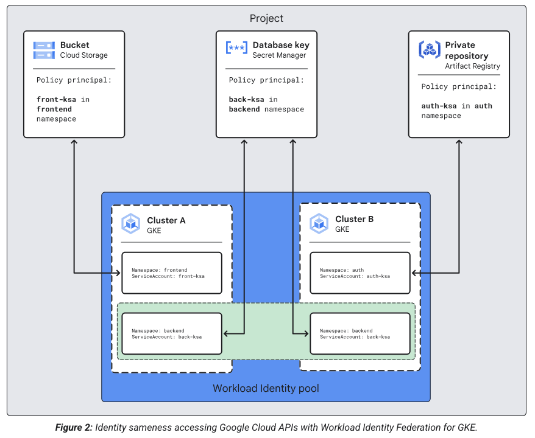
		- https://docs.cloud.google.com/kubernetes-engine/docs/concepts/workload-identity#identity_sameness
		- Note: Your interpretation of the diagram is spot on. In Google Cloud,<font color="#ff0000"> there is **only one Workload Identity pool** automatically created for each project</font>. While clusters exist within a project, they do not "own" their own pools; instead, they all point to this single, fixed project-level pool.
	- WI Auth Flow
	https://docs.cloud.google.com/kubernetes-engine/docs/concepts/workload-identity#credential-flow

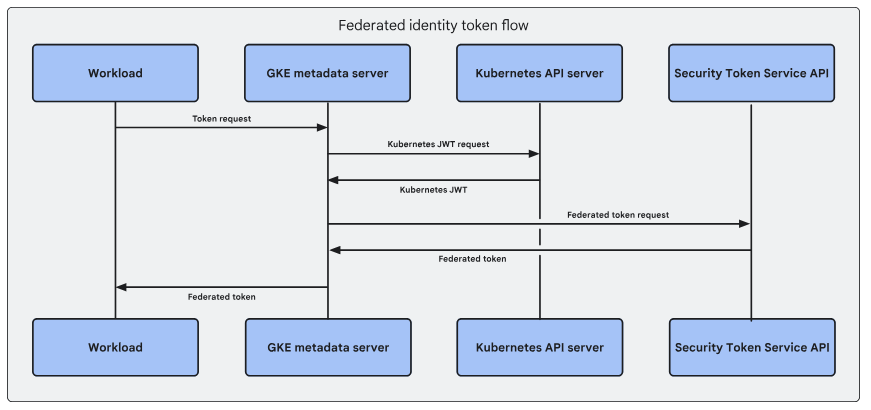

- Workload identiyy enabled but default GCE service account (fall back...)
- 
- ksa token issuer (API server), KSA to GSA token exchanger (metdata server), google identiry pool
	- - Registers the GKE cluster as an identity provider in the workload identity pool. (https://docs.cloud.google.com/kubernetes-engine/docs/concepts/workload-identity#how_works)
- WI1.0 vs WI2.0: Before and after
- WI KSA Principals (non-lfeet and fleet)
- Note: Conditional IAM policies: e.g. time expiration
	- https://docs.cloud.google.com/kubernetes-engine/docs/concepts/workload-identity#use-iam-conditions
	- 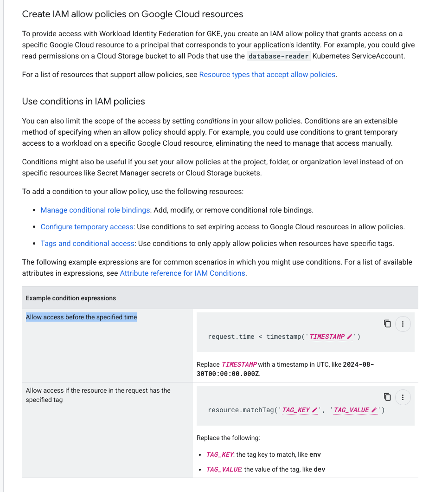

- sameness and design gotcha: see [[#Design gotcha]]
	- 
	-  if a new cluster, Cluster C in the previous example was owned by an untrusted team, they could create a `backend` namespace and access Google Cloud APIs using the `back-ksa` ServiceAccount, just like Cluster A and Cluster B.
# Workload Identity Federation Deck

https://docs.google.com/presentation/d/1pOZNrm8VVd943DdZtER2WHS3-zJRrtdVK2Gmk4IS1fA/edit?usp=sharing
and local copy: https://docs.google.com/presentation/d/15Wh_aAQY97Bxat8MDavtmTdta4eeGRb76AI9p-TpT-o/edit?usp=sharing


# Identity providers: ksa token issuer, metadata server, google identity pool


When discussing the "Identity Provider" in the context of GKE Workload Identity, it is important to distinguish between the **on-cluster component** and the **Google Cloud-side management**.

The identity provider logic is not a single "pod" you can point to; rather, it is a distributed system that splits responsibility between your cluster and Google’s global IAM infrastructure.

- Creates a fixed _workload identity pool_ for the cluster's Google Cloud project
- <font color="#ff0000">Registers the GKE cluster as an identity provider </font>in the workload identity pool.
https://docs.cloud.google.com/kubernetes-engine/docs/concepts/workload-identity#how_works
- Deploys the [_GKE metadata server_](https://docs.cloud.google.com/kubernetes-engine/docs/concepts/workload-identity#metadata_server), which intercepts credential requests from workloads, on every nod


### 1. The On-Cluster Component: The Kubernetes API Server

The actual "issuer" of the initial identity is the **Kubernetes Control Plane (API Server)**.

- It is **not** a separate DaemonSet.
- The API Server acts as the **OIDC (OpenID Connect) Issuer**.
- When a Pod starts, the API Server issues a **ServiceAccount Token** (a signed JWT). This token is the "proof of identity" that says "I am the Pod named _X_ in namespace _Y_."
    

### 2. The Link: The GKE Metadata Server (DaemonSet)

As we discussed earlier, the component that actually interacts with this identity on your worker nodes is the **`gke-metadata-server` DaemonSet**.

- It acts as the local "broker."
- It takes the Kubernetes <font color="#ff0000">token from the Pod and sends it to Google's **Security Token Service (STS)** to exchange it</font> for a Google Cloud access token. (see [[#STS token exchange]])
    

### 3. The Identity Pool (Google Cloud Side)

The "Identity Provider" registration actually happens at the **IAM project level**, not inside your cluster as a pod.

- When you enable Workload Identity, Google automatically creates a **Workload Identity Pool** named `PROJECT_ID.svc.id.goog`.
- Your specific<font color="#ff0000"> GKE cluster is registered as a **Workload Identity Provider** _inside_ that pool</font>.
- This registration is a configuration setting in Google Cloud IAM, not a running workload in your cluster.

> [!tip]+ list registered identity providers with WI pool
> gcloud iam workload-identity-pools providers list \
 >   --location="global" \
 >   --workload-identity-pool="PROJECT_ID.svc.id.goog" \
 >   --project="PROJECT_ID"


# STS token exchange
When you request a token, the verification of that "needed principal" happens at the very moment the **Security Token Service (STS)** receives the request from the GKE Metadata Server.

It isn't a single check, but a "trust chain" that connects the Kubernetes Pod to the Google Cloud IAM policy in three distinct phases:

### 1. Verification of Authenticity (The Cryptographic Check)

When the Metadata Server sends the Kubernetes-signed JWT to STS, the STS doesn't just take its word for it.

- **OIDC Check:** STS contacts the **Cluster's OIDC Issuer URL** (a public endpoint managed by GKE) to fetch the cluster's public keys.
    
- **Signature Validation:** STS uses those keys to verify that the JWT was actually signed by your specific GKE cluster's API server and hasn't been tampered with.
    
- **Identity "Naming":** Once verified, STS "translates" the Kubernetes Service Account (KSA) into a Google-readable identity string (the principal) like: `principal://iam.googleapis.com/.../subject/ns/NAMESPACE/sa/KSA_NAME`
    

### 2. Verification of Policy (The "Is this allowed?" Check)

Now that STS knows _exactly_ who the KSA is, it checks the **IAM Policy** of the Google Service Account (GSA) you want to use.

- **`roles/iam.workloadIdentityUser`:** STS looks for this specific role on the GSA's IAM policy.
    
- **Member Matching:** It checks if the "translated" KSA principal from Step 1 is listed as a member in that role.
    
- **Result:** If the KSA principal is found in the policy, the "Principal-to-GSA" binding is verified.
    

### 3. Token Issuance (The Final Exchange)

Only after both the **Identity** (Step 1) and the **Permission to Impersonate** (Step 2) are verified does the exchange complete.

- STS issues a short-lived **Federated Token**.
    
- If the workload requires it, the GKE Metadata Server automatically exchanges that federated token for a standard **Google Cloud Access Token** for the GSA.


# Cloud Platform Support: k8s SA
https://g3doc.corp.google.com/company/gfw/support/cloud/jumpstarts/container-engine/k8s-service-account.md?cl=head


KSA: Kubernetes service accounts are part of the GKE cluster in which they are defined and it is a <font color="#ff0000">namespace scoped object</font>

IAM Service Accounts: IAM service accounts are part of a Google Cloud project, and <font color="#ff0000">can be granted permissions both within clusters and to Google Cloud project</font>, as well as to any Google Cloud resource, <font color="#ff0000">using Identity and Access Management (IAM)</font>.

<font color="#ff0000">When you create a namespace in the GKE cluster, it automatically creates a Kubernetes service account object named `default` in this namespace</font>. 
If you delete the `default` ServiceAccount object in a namespace, the control plane replaces it with a new one. 

This `default` service account in each namespace gets no permissions by default other than the default API discovery permissions that Kubernetes grants to all authenticated principals if role-based access control (RBAC) is enabled.


Application Pods and system components can use a specific service account's credentials to identify as that service account.

You can create a service account using the following command.

```
kubectl create serviceaccount 
```

When <font color="#ff0000">you create a service account in a GKE cluster, a service account token also gets generated</font>. This token is what will be required by the application to access the Kubernetes APIs.
You can view the token using the following command.
```
kubectl describe serviceaccount 
```
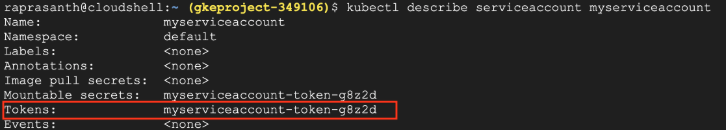

From the above output, you will see that the Tokens attribute is created with the value: `myserviceaccount-token-g8z2d`. <font color="#ff0000">This token is stored as a secret object</font>, and this secret object is attached to the service account:`myserviceaccount`.


 From version 1.22 onwards, Kubernetes introduced <font color="#ff0000">TokenRequest API. A token generated through this API is a time-bound token that expires after a time</font> (by default, that is 1 hour). It applies to both the default service account and the custom-defined service accounts.
To view the secret object, you can execute the following command. You can view the encoded hash-key value of the token as highlighted below:


```
kubectl describe secret 
```
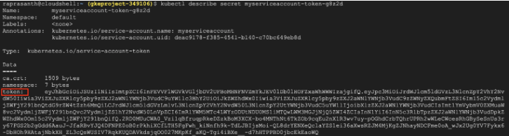

This is the key that can be exchanged as an <font color="#ff0000">authentication bearer token to access the Kubernetes API</font>.


Now you grant permissions to the ServiceAccount object using an authorization mechanism such as [RBAC](https://g3doc.corp.google.com/company/gfw/support/cloud/jumpstarts/container-engine/gke-rbac.md?cl=head).

Permissions are granted to a Service Account through Roles and RoleBindings (or ClusterRoles and ClusterRoleBindings for cluster-wide permissions):

- **Role:** Defines permissions within a namespace.
- **RoleBinding:** Binds a Role to a Service Account within a namespace.
- **ClusterRole:** Similar to Role but for cluster-wide permissions.
- **ClusterRoleBinding:** Binds a ClusterRole to a Service Account for cluster-wide permissions.

Here’s an example of a Role and RoleBinding that grants a Service Account read-only access to Pods within a namespace:

Role:
```yaml
kind: Role
apiVersion: rbac.authorization.k8s.io/v1
metadata:
  namespace: my-namespace
  name: pod-reader
rules:
- apiGroups: [""]
  resources: ["pods"]
  verbs: ["get", "watch", "list"]
```

Role binding:
```yaml
kind: RoleBinding
apiVersion: rbac.authorization.k8s.io/v1
metadata:
  name: read-pods
  namespace: my-namespace
subjects:
- kind: ServiceAccount
  name: my-service-account
  namespace: my-namespace
roleRef:
  kind: Role
  name: pod-reader
  apiGroup: rbac.authorization.k8s.io
```

Then, assign the ServiceAccount object to pods. You can find the example pod YAML file below.
```yaml
apiVersion: v1
kind: Pod
metadata:
  name: nginx
spec:
  containers:
  - image: nginx
    name: nginx
  serviceAccountName: myserviceaccount
```

where the service account is:
```yaml
apiVersion: v1
kind: ServiceAccount
metadata:
  name: my-service-account
  namespace: my-namespace
```

and use the service account on the pod:

```yaml
apiVersion: v1
kind: Pod
metadata:
  name: my-pod
  namespace: my-namespace
spec:
  serviceAccountName: my-service-account
  containers:
  - name: my-container
    image: my-image
```


# k8s SA in action: Image pull error
https://rudimartinsen.com/2024/01/13/cka-notes-kubernetes-service-accounts-2024/


and 

> [!quote]+ SA for image pull
> **Note:** Even with Workload Identity Federation for GKE configured on a cluster, GKE still uses the configured IAM service account for the node pool to pull container images from the image registry. If you encounter `ImagePullBackOff` or `ErrImagePull` errors, see [Troubleshoot image pulls](https://docs.cloud.google.com/kubernetes-engine/docs/troubleshooting/image-pulls).
> https://docs.cloud.google.com/kubernetes-engine/docs/concepts/workload-identity#credential-flow


# JWT Private key
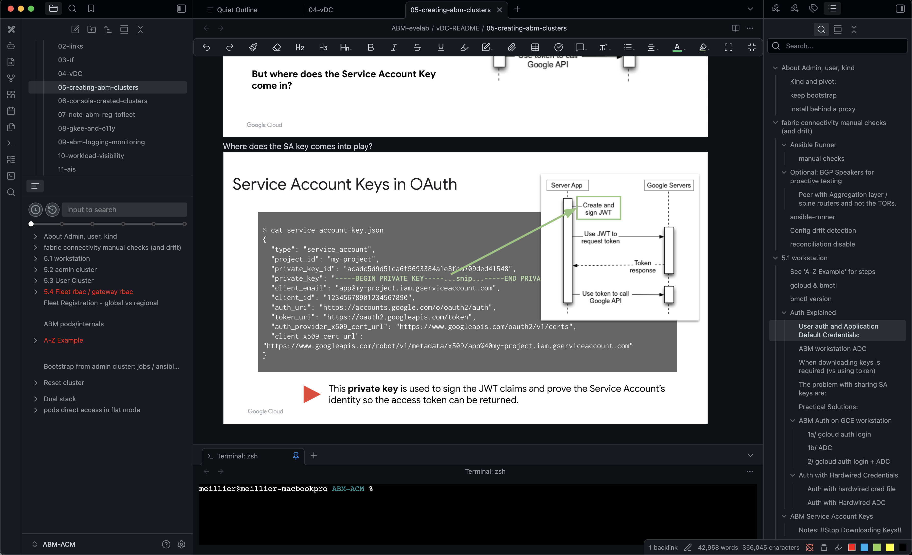


# Cloud platform support: GKE WI
https://g3doc.corp.google.com/company/gfw/support/cloud/playbooks/container-engine/workload-identity.md?cl=head


## Workflow details 
go/gke-workload-identity-support#workflow-details

# System pods and kubelet

> [!important]+ 
> Important: Image pulls from Google Container Registry (GCR) or Artifact Registry (AR) by the kubelet (a process on the VM) do not use Workload Identity. Ensure that the node pool has the right access scopes configured and the [service account used has the correct permissions to pull the image](https://g3doc.corp.google.com/company/gfw/support/cloud/playbooks/container-engine/image-pull-permission.md#pulling-from-container-registry-or-artifact-registry). The same applies to system pods like `fluentbit-gke` and `gke-metrics-agent` that use the node service account to access Cloud Logging and Monitoring respectively.

> [!important]+ 
> System workloads and workloads with `hostNetwork: true` are configured to bypass MDS and instead route requests to the underlying node's metadata server.

# Playbook (lots of deep details)
https://g3doc.corp.google.com/company/gfw/support/cloud/playbooks/container-engine/workload-identity.md?cl=head

# GKE Training: WI and IAM
https://docs.google.com/presentation/d/1eQYoHKJJ_7V86DxDnNEFAc0O-9OAdFlqvOsVcffIPag/edit

https://docs.google.com/presentation/d/1_3Q7tw_lQLIB3e-vFXXTdgQTOMHksSeaUJu5I4fxIi8/edit?usp=sharing

# Deck: Workload Identity 2.0
https://docs.google.com/presentation/d/1FzaC4Gpi2xprj6FFLfs6I41gx3qinKqcsQUmIUrcA04/edit?usp=sharing
## How it used to work
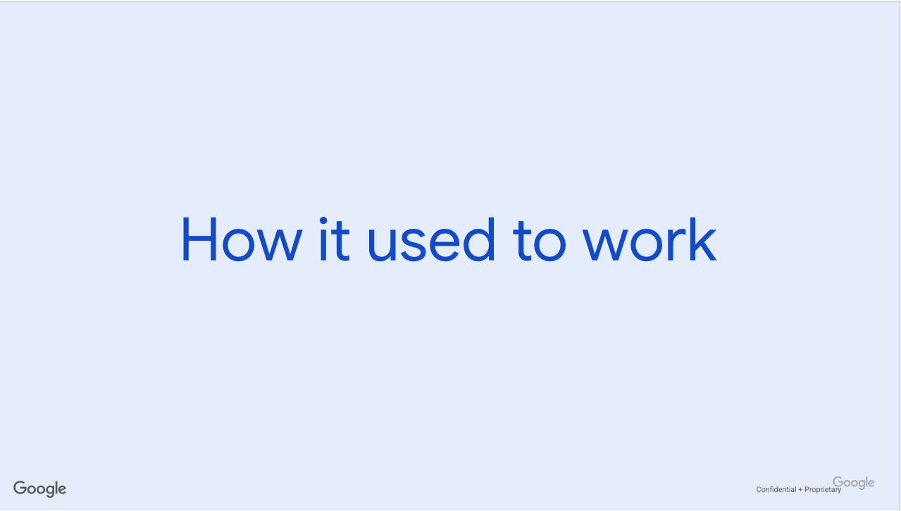
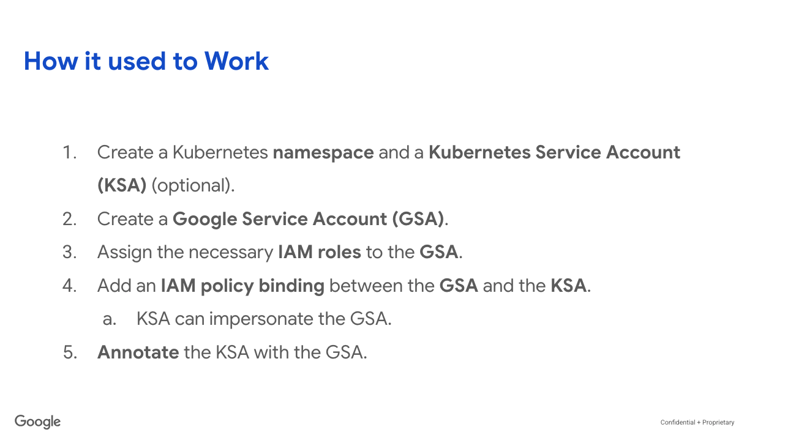

- Create a Kubernetes namespace and a Kubernetes Service Account (KSA) (optional).
- Create a Google Service Account (GSA).
- Assign the necessary IAM roles to the GSA.
- Add an IAM policy binding between the GSA and the KSA.
- KSA can impersonate the GSA.
- Annotate the KSA with the GSA.

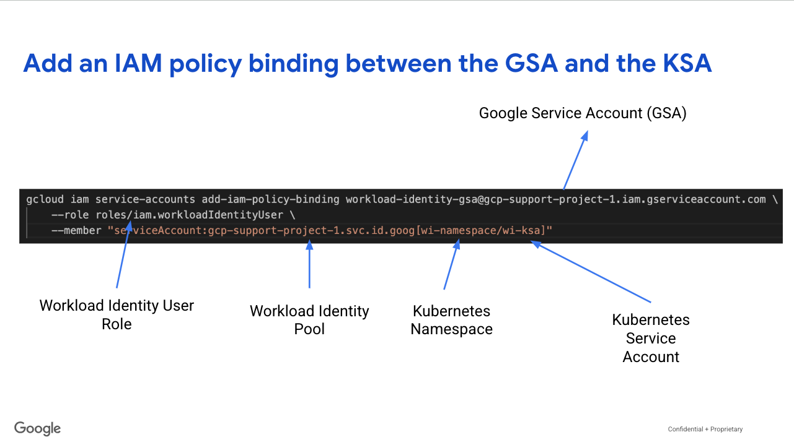

## What Changed 
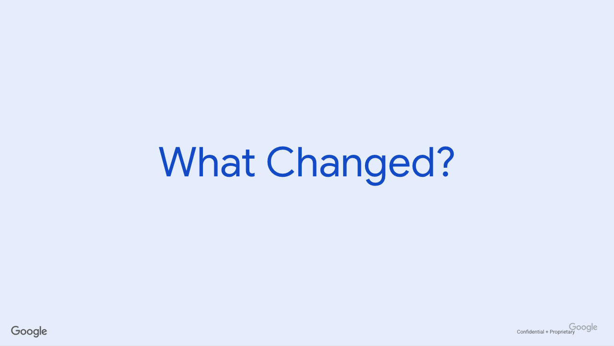
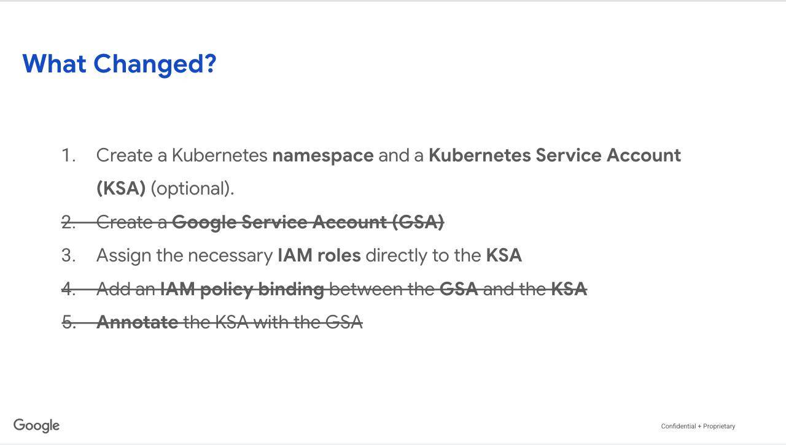

Create a Kubernetes namespace and a Kubernetes Service Account (KSA) (optional).
- Create a Google Service Account (GSA)
- Assign the necessary IAM roles directly to the KSA


## New KSA Principals
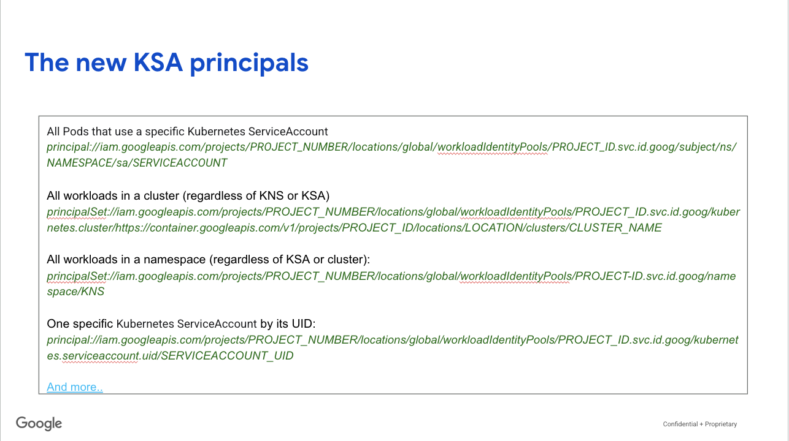
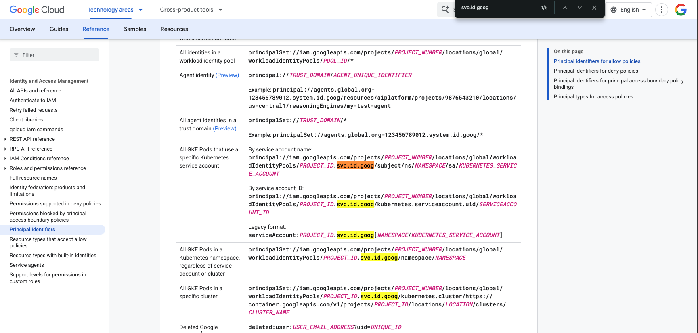

and more
https://cloud.google.com/iam/docs/principal-identifiers
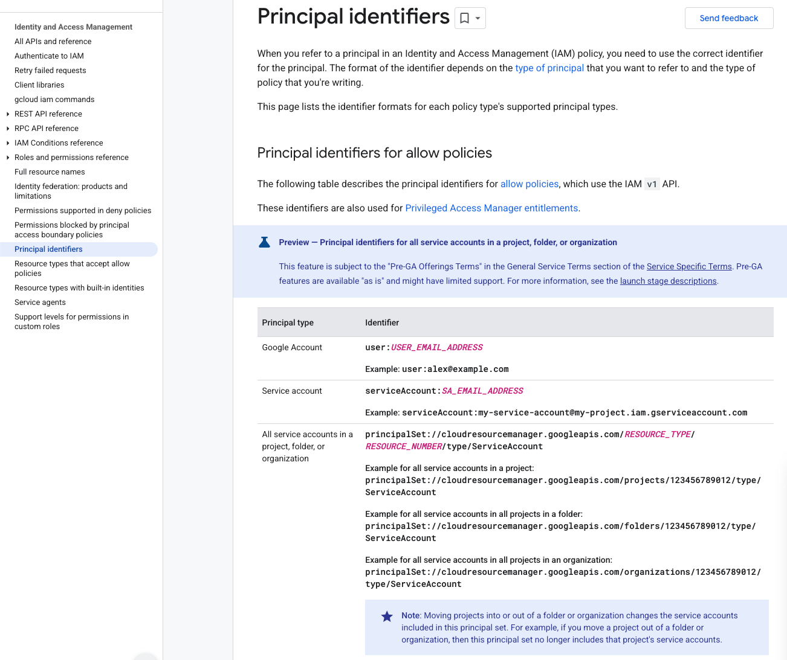

## Example
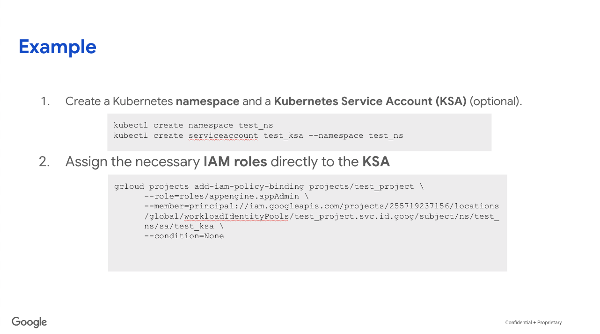

## How is an Acccess Token Fetched
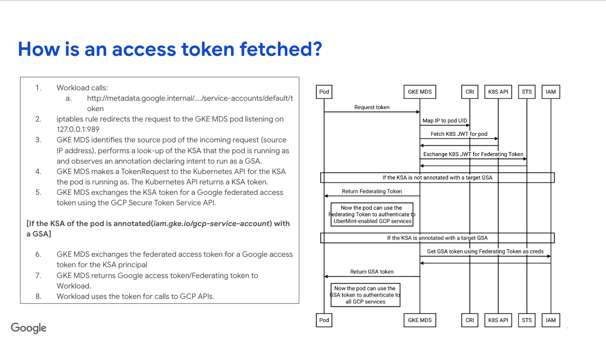

1. Workload calls: http://metadata.google.internal/…./service-accounts/default/token
2. iptables rule redirects the request to the GKE MDS pod listening on 127.0.0.1:989
3. GKE MDS (Metadata Server) identifies the source pod of the incoming request (source IP address), performs a look-up of the KSA that the pod is running as and observes an annotation declaring intent to run as a GSA.
4. <font color="#ff0000">GKE MDS makes a TokenRequest to the Kubernetes API for the KSA the pod is running as</font>. The Kubernetes API returns a KSA token.
5. GKE <font color="#ff0000">MDS exchanges the KSA token for a Google federated access token using the GCP Secure Token Service API</font>.
[If the KSA of the pod is annotated(iam.gke.io/gcp-service-account) with a GSA]
6. GKE <font color="#ff0000">MDS exchanges the federated access token for a Google access token for the KSA principal</font>
<font color="#ff0000">GKE MDS returns Google access token/Federating token to Workload</font>.
7. Workload uses the token for calls to GCP APIs.
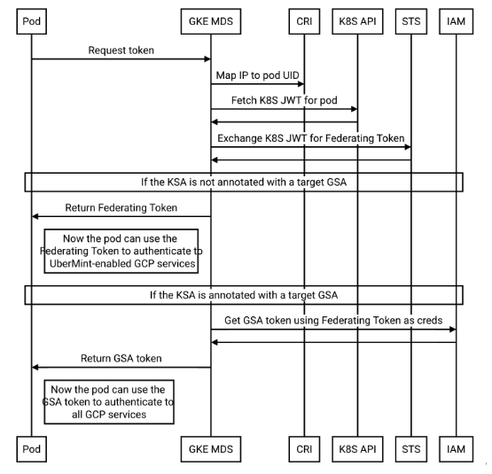


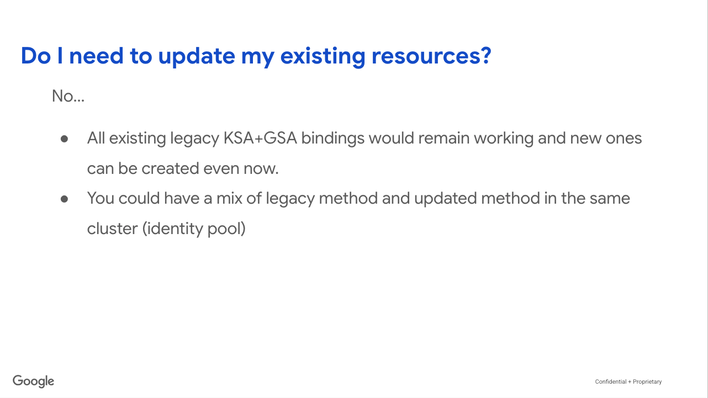
## Limitations
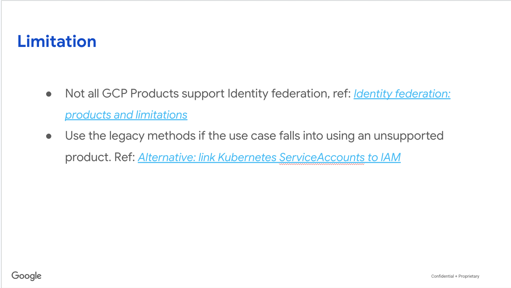

### Alternative./ Legacy Method
https://docs.cloud.google.com/kubernetes-engine/docs/how-to/workload-identity#kubernetes-sa-to-iam
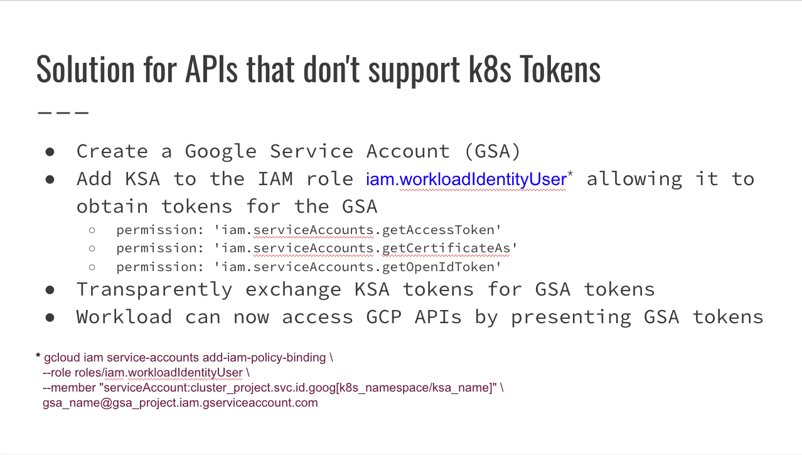
## Federation Identity Supported services.


When a service is not supported by Federation Identity, then one need to use the legacy method

https://docs.cloud.google.com/iam/docs/federated-identity-supported-services#cloud-shell

Based on the "Identity federation: products and limitations" documentation, the following Google Cloud services are explicitly listed as **Unsupported** for identity federation:

- **App Engine**: Google recommends using Cloud Run as an alternative ( [ source](https://docs.cloud.google.com/iam/docs/federated-identity-supported-services?content_ref=app+engine+unsupported+alternatives+google+recommends+that+you+use+cloud+run+as+an+alternative)).
- **Cloud Code**: There are no recommended alternatives provided.
- **Cloud Deployment Manager**: No alternatives are currently available.
- **Cloud Endpoints**: No alternatives are currently available.
- **Cloud Mobile App**: No alternatives are currently available ( [ source](https://docs.cloud.google.com/iam/docs/federated-identity-supported-services?content_ref=cloud+mobile+app+unsupported+alternatives+no+alternatives+available)).
- **Cloud Profiler**: No alternatives are currently available.
- **Cloud Shell**: Google recommends using Cloud Workstations as an alternative ( [ source](https://docs.cloud.google.com/iam/docs/federated-identity-supported-services?content_ref=cloud+shell+unsupported+alternatives+google+recommends+that+you+use+cloud+workstations+as+an+alternative)).
- **Cloud Source Repositories**: No alternatives are listed in this document.
- **Endpoint Verification**: No alternatives are currently available.
- **Enterprise Knowledge Graph**: No alternatives are currently available.
- **Google Distributed Cloud**: No alternatives are currently available.
- **Looker (Google Cloud core)**: No alternatives are currently available ( [ source](https://docs.cloud.google.com/iam/docs/federated-identity-supported-services?content_ref=looker+google+cloud+core+unsupported+alternatives+no+alternatives+available)).
- **Looker Studio**: No alternatives are currently available.
- **Translation Hub**: No alternatives are currently available.


## Reference k8s resource in IAM policies: IAM principal IDentifier
https://docs.cloud.google.com/kubernetes-engine/docs/concepts/workload-identity#kubernetes-resources-iam-policies

In your IAM policy, you refer to a Kubernetes resource by<font color="#ff0000"> using an IAM _principal identifier_ </font>to select the resource.


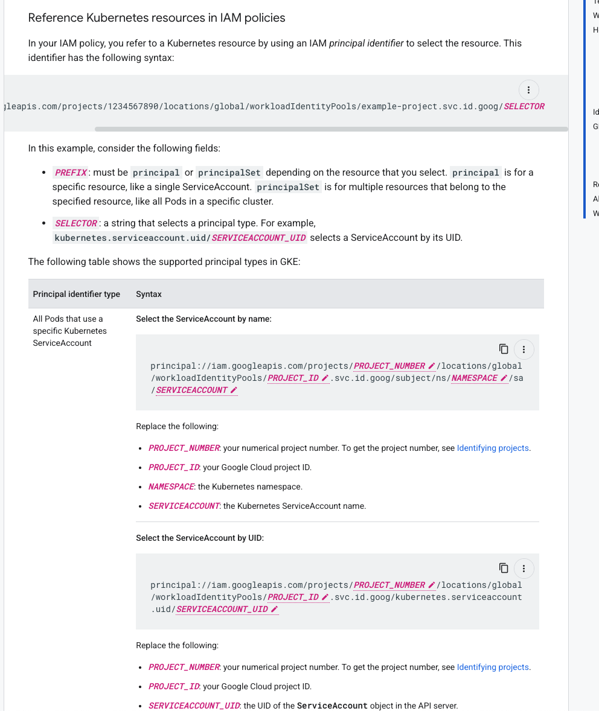

### All Pods that use a specific Kubernetes ServiceAccount
### All Pods in a namespace, regardless of service account or cluster
### All Pods in a specific cluster


## Principal Types
https://docs.cloud.google.com/iam/docs/principals-overview#principal-types

# Identity pool and GKE workload Identity


a **Workload Identity Pool** is a Google Cloud resource that lets you manage identities from **outside of Google Cloud** (like AWS, Azure, GitHub Actions, or on-premises servers) so they can access GCP resources without needing risky, long-lived JSON service account keys.


A pool acts as a container for external identities. It consists of two main parts:

### 1. Pool Part 1: The Provider (The Source of Truth)

This is where you define who you trust. You <font color="#ff0000">configure the pool to listen to a specific external identity provider (IdP</font>) using protocols like:

- **OIDC (OpenID Connect):** Used by GitHub Actions, GitLab, or Terraform Cloud.
- **SAML:** Used by enterprise identity providers like Okta or Active Directory.
- **AWS/Azure:** Direct integrations for workloads running on those clouds.

Note: in the case of GKE, <font color="#ff0000">Google simply "pre-builds" the pool</font> (`PROJECT_ID.svc.id.goog`) (dedicated to GKE) and<font color="#ff0000"> the provider (your Kubernetes cluster)</font> so you don't have to set up the OIDC handshake manually.

#### User-Created Pools (External Identity Federation)

When you want to connect **AWS, Azure, or GitHub**, you create a **Workload Identity Pool** yourself.

- **Naming:** These do _not_ use the `.svc.id.goog` suffix. They usually look like: `projects/PROJECT_NUMBER/locations/global/workloadIdentityPools/MY-POOL-ID`
    
- **Purpose:** These are for "Generic" federation where _you_ define the trust relationship and attribute mappings.
### 2. Pool Part 2: Attribute Mapping (The Translator)

Since an AWS Role or a GitHub Repo doesn't look like a Google identity, the <font color="#ff0000">pool "translates" their attributes into something Google understands</font>.

- **Example:** You can map the GitHub `repository` attribute to a Google `attribute.repository`.
    

---

## The Authentication Flow

When an external workload wants to talk to GCP, it follows this "Handshake" process:

1. **Identity Token:** The external workload (e.g., a GitHub Action) <font color="#ff0000">gets a signed token from its own provider.</font>
    
2. **Exchange:** It s<font color="#ff0000">ends that token to the **Workload Identity Pool**</font>.
> In the context of GitHub Actions, the "configuration" that tells the CI/CD tool where to send its token is a mix of **Infrastructure setup** (on Google Cloud) and **Workflow definition** (on GitHub).

Neither GitHub nor Google Cloud "knows" about the other until you explicitly establish a trust relationship. Here is how both sides are rephrased to work together:

### 1. The Google Cloud Side: Building the "Front Door"

You create a **Workload Identity Provider** inside your pool. This acts as the specific "receptionist" for GitHub.

- **The Issuer URL:** You tell Google to only trust tokens issued by `https://token.actions.githubusercontent.com`. This is how Google knows the token is actually from GitHub.
    
- **The Provider ID:** Google generates a unique resource name for this provider (e.g., `projects/123/locations/global/workloadIdentityPools/my-pool/providers/my-provider`). **This is the destination address** you will give to GitHub later.
    
> [!summary]+ for example: github actions for cicd		
> ### 1. Github actions 101:
> To understand GitHub Actions, you only need to know these four terms:
> 
> - **Workflow:** The entire "playbook" or process, defined in a `.yml` file in your `.github/workflows` folder.
>     
> - **Events:** The "Trigger." This is what tells the robot to start (e.g., a `push`, a `pull_request`, or a scheduled time).
>     
> - **Jobs:** A workflow is made of one or more "Jobs." By default, these run in parallel, but you can make them wait for each other.
>     
> - **Steps/Actions:** These are the individual tasks inside a job. An **Action** is a reusable piece of code (like a plugin) that performs a complex task, such as "Login to Google Cloud". 
> 
> Github runner: A **GitHub Runner** is the actual machine (the server) that executes the jobs defined in your GitHub Actions workflow.
> 
> ### 2. The GitHub Side: Defining the "Handshake"
> 		
> 		GitHub Actions doesn't automatically reach out to Google. You must configure your `.yml` workflow file with two specific components to "drive" the token to the right place:
> 		
> #### A. Requesting the Identity Token
> 		
> 		By default, a GitHub runner doesn't have a signed identity token. You must explicitly grant it the permission to generate one in your workflow YAML:
> 		
> 		YAML
> 		
> 		```
> 		permissions:
> 		  id-token: write  # Required to request the JWT from GitHub's OIDC provider
> 		  contents: read   # Standard permission to read the repo
> 		```
> 		
> #### B. The "Authentication" Step
> 		
> 		You use a specialized action (like `google-github-actions/auth`) and provide it with the **Provider ID** you created in Step 1.
> 		
> 		YAML
> 		
> 		```
> 		- uses: 'google-github-actions/auth@v2'
> 		  with:
> 		    workload_identity_provider: 'projects/123/locations/global/workloadIdentityPools/my-pool/providers/my-provider'
> 		    service_account: 'my-sa@my-project.iam.gserviceaccount.com'
> 		```
> 		
> ### How it all connects at runtime
> 		
> 		1. **GitHub** sees the `id-token: write` permission and prepares a signed token (JWT) containing your repo and branch info.
> 		    
> 		2. The **Auth Action** takes that token and the `workload_identity_provider` address you provided.
> 		    
> 		3. The **Auth Action** "phones" Google's Security Token Service (STS) at that specific provider address and hands over the GitHub token.
> 		    
> 		4. **Google** checks its configuration: "Do I trust tokens from `token.actions.githubusercontent.com`? Does this token come from the specific GitHub repo I allowed?".
> 		    
> 		5. If yes, **Google** hands back a short-lived Google Cloud token.
    
- **Validation:** The Pool checks if the token is valid and if it comes from a trusted provider.
    
-  **STS (Security Token Service):** If valid, G<font color="#ff0000">oogle’s STS exchanges that external token for a **short-lived Google access token**</font>.
    
-  **Access:** <font color="#ff0000">The workload uses that temporary token to call Google APIs (like uploading to a Bucket</font>.


## Why use a Pool instead of a Service Account Key?
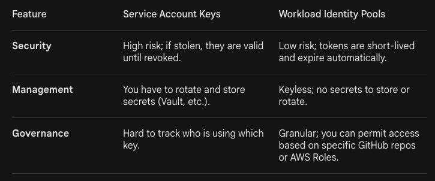
---

# The Dedicated GKE Workload pool

GKE Workload Identity is actually just a **specialized, pre-configured version** of this technology. <font color="#ff0000">Google simply "pre-builds" the pool</font> (`PROJECT_ID.svc.id.goog`) and<font color="#ff0000"> the provider (your Kubernetes cluster)</font> so you don't have to set up the OIDC handshake manually.

Your GKE workloads use a pool that is "known" to IAM but doesn't require manual setup in the Federation console. When you want to grant a Pod permissions, you reference it using this principal format: `principal://iam.googleapis.com/projects/PROJECT_NUMBER/locations/global/workloadIdentityPools/PROJECT_ID.svc.id.goog/subject/ns/NAMESPACE/sa/KSA_NAME`


### 1. The Reserved Pool (`PROJECT_ID.svc.id.goog`)

When you enable Workload Identity on a GKE cluster, Google **automatically** creates this specific pool for you.

- **Purpose:** It is hardcoded for Kubernetes-native identities.
    
- **Naming:** It _must_ follow that exact format. You cannot rename it, and you cannot create a pool with that name manually for your own external providers (like AWS or GitHub).
    
- **Management:** Google manages the OIDC provider (your cluster) within this pool.
- 

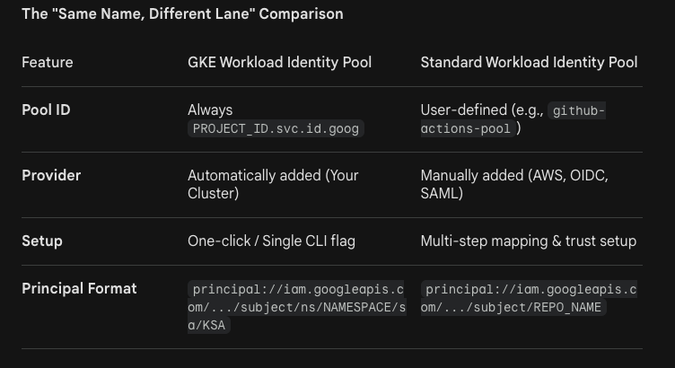

# --workload-pool
`--workload-pool`=`WORKLOAD_POOL`

Enable Workload Identity on the cluster.

When enabled, Kubernetes service accounts will be able to act as Cloud IAM Service Accounts, through the provided workload pool.

Currently, the only accepted workload pool is the workload pool of the Cloud project containing the cluster, `PROJECT_ID.svc.id.goog`.


Workload Identity was enabled on your cluster because you included the `--workload-pool="project-01749.svc.id.goog"` flag.
### Not in the console (hidden)
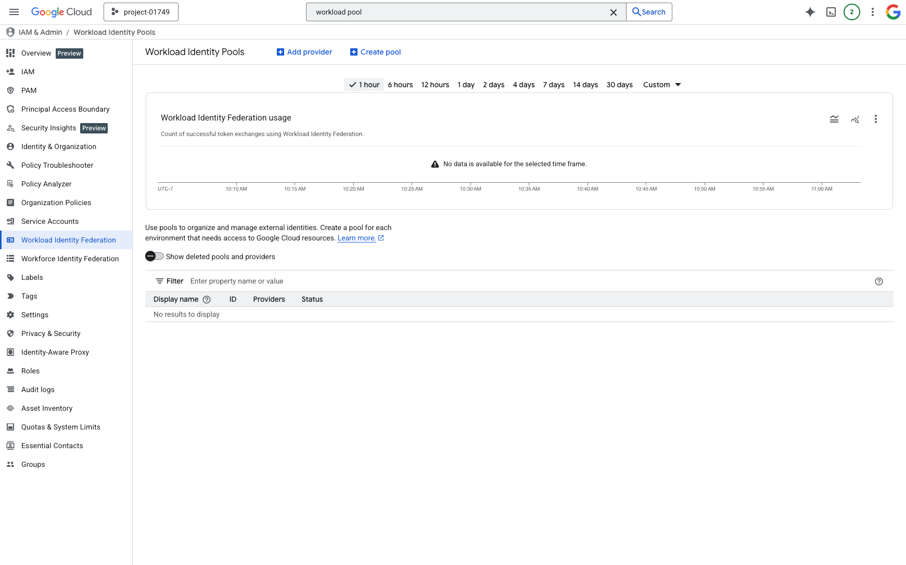

### Why you don't see it in the "Workload Identity Federation" tab


It is completely normal that your GKE pool does not appear in the screenshot you provided. Here is the distinction:

- **Workload Identity Federation (The tab in your image):** This is used for **external** identities, such as workloads running on AWS, Azure, or GitHub Actions that need to access Google Cloud resources.
    
- **GKE Workload Identity:** This is a **Google-managed** implementation of that same federation technology. GKE automatically creates a "fixed" pool for your project with the format `PROJECT_ID.svc.id.goog`. Because Google manages this pool and its provider for you, it is generally hidden from the standard "Workload Identity Federation" UI to prevent accidental modification.


#### 1. List all Workload Identity Pools

To list the pools you've created for external federation (the ones that would show up in your screenshot), use:


```
gcloud iam workload-identity-pools list --location="global"
```

Note: If you haven't created any external pools, this will return 0 items.

#### 2. Verify GKE's Workload Identity status

Since the GKE pool is managed, you check its status by describing your cluster directly:

```
gcloud container clusters describe "acp-dev" \
  --region "us-central1" \
  --format="value(workloadIdentityConfig.workloadPool)"
```
If this returns `project-01749.svc.id.goog`, then Workload Identity is active and the pool exists in the backend.

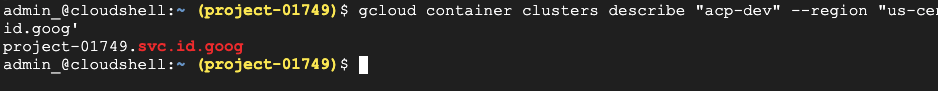


### Why only one pool per project?

GKE enforces a 1:1 relationship between a project and its workload pool to maintain security boundaries. By strictly using `PROJECT_ID.svc.id.goog`, Google ensures that:

- **Namespace isolation:** A "default" namespace in Project A is distinct from a "default" namespace in Project B.
    
- **Global Uniqueness:** No two organizations can accidentally claim the same identity pool.

When you enable Workload Identity, GKE configures a **Metadata Server** on every node. Here is the lifecycle of how that pool is used:

1. **The Pod Request:** Your application pod asks for a Google Cloud resource (like a Cloud Storage bucket).
    
2. **The Token Exchange:** The pod presents its **Kubernetes ServiceAccount (KSA)** token to the GKE Metadata Server.
    
3. **The Pool Verification:** The Metadata Server sends this to IAM. IAM looks at the pool ID (`PROJECT_ID.svc.id.goog`) to verify that this Kubernetes cluster is actually authorized to represent that project.
    
4. **The IAM Impersonation:** If the KSA is "bound" to a **Google ServiceAccount (GSA)**, IAM issues a short-lived Google OAuth token.
    

## Workload IDentity pool in GCP Porject out side of GKE


## 3. The "Identity" Mapping

Inside this workload pool, your Kubernetes identities are represented in IAM using a specific principal format. If you want to grant a Pod permissions, you don't grant them to the Pod itself; you grant them to the identity within the pool:

`principal://iam.googleapis.com/projects/PROJECT_NUMBER/locations/global/workloadIdentityPools/PROJECT_ID.svc.id.goog/subject/ns/NAMESPACE/sa/KSA_NAME`

### Other KSA Principals 
see [[#New KSA Principals]]

https://docs.cloud.google.com/kubernetes-engine/docs/concepts/workload-identity#kubernetes-resources-iam-policies
and more
https://cloud.google.com/iam/docs/principal-identifiers


### Example


## Namespace and KSA uniqueness across clusters

> [!question]+ Question: if i have two clusters in the same project and each cluster has the same k8s namespace provisioned. Say test
> i have workload in that name space with a KSA called admin.
> That would be an issue for workload identity as the principals are not the same but the sytnax is the same?
> `principal://iam.googleapis.com/projects/PROJECT_NUMBER/locations/global/workloadIdentityPools/PROJECT_ID.svc.id.goog/subject/ns/NAMESPACE/sa/KSA_NAME`
> NAMESPACE would be the same
> KSA_NAME would be the same.
> yet the intent is for cluster A workload in that namespace to have access to a Google 1P service such as cloud storage or bigquery while the workload in the other cluster would not.
> 


> [!question]+ Answer:
> Actually, you’ve hit on one of the most important security nuances of GKE Workload Identity. Because the **Workload Identity Pool** is shared at the **Project** level (using the same `PROJECT_ID.svc.id.goog` name), the principal identifier for a Kubernetes Service Account (KSA) does not inherently include the cluster name.
> 
> As you noted, the principal for both clusters would be: `principal://iam.googleapis.com/projects/PROJECT_NUMBER/locations/global/workloadIdentityPools/PROJECT_ID.svc.id.goog/subject/ns/test/sa/admin`
> 
> ### Is this a security issue?
> 
> **Yes, if you use the default principal format.** If you grant an IAM role to that specific principal, **both** clusters will have that permission because they both present the same identity to Google Cloud.
> 
> ---
> 
> ### How to solve this: The "Cluster-Specific" Principal
> 
> To achieve your goal where Cluster A has access but Cluster B does not, you must use a more granular principal format that includes the **Cluster Name** and **Location**.
> 
> Instead of the standard `subject` (which only looks at namespace/KSA), you can use the `attribute.cluster_name` and `attribute.namespace` identifiers in your IAM binding.
> 
> #### 1. The Granular Principal Syntax
> 
> You can bind the IAM role to a principal that specifies the cluster name as an attribute: `principalSet://iam.googleapis.com/projects/PROJECT_NUMBER/locations/global/workloadIdentityPools/PROJECT_ID.svc.id.goog/attribute.cluster_name/CLUSTER_NAME`
> 
> #### 2. Applying it to your scenario
> 
> To give **Cluster A** access to BigQuery, but deny **Cluster B**, you would run a command similar to this:
> 

Default/commonly used Principal:
`principal://iam.googleapis.com/projects/PROJECT_NUMBER/locations/global/workloadIdentityPools/PROJECT_ID.svc.id.goog/subject/ns/test/sa/admin`


# Slides
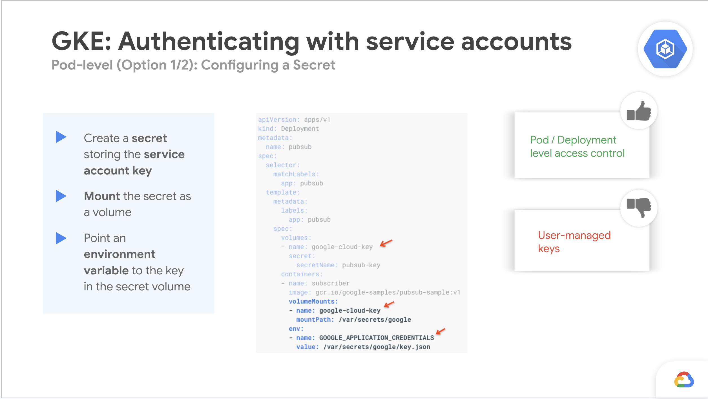
https://docs.google.com/presentation/d/1xBb8k1HeK8KhRR70H34uy3W-5uOlF7-vOPBw3bnqLvY/edit?usp=sharing&resourcekey=0-u18e0atDbc67oYC8g39-NQ

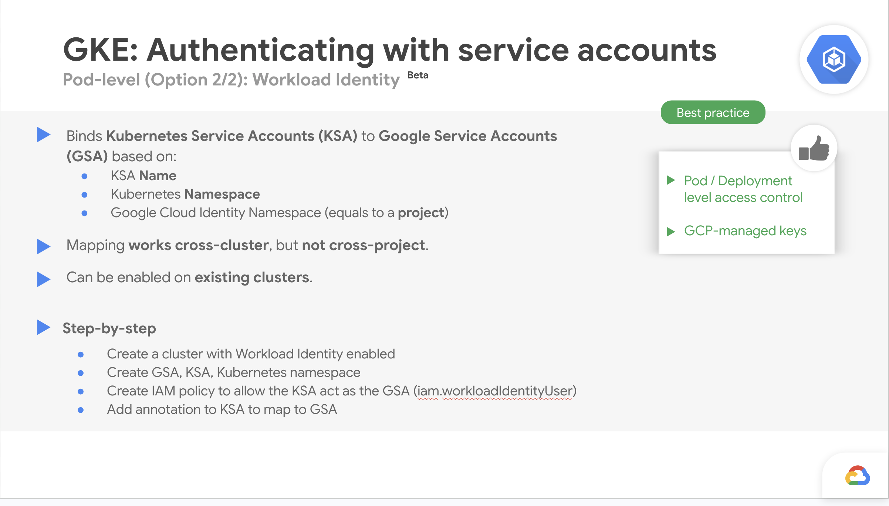


# Slides about workload identity
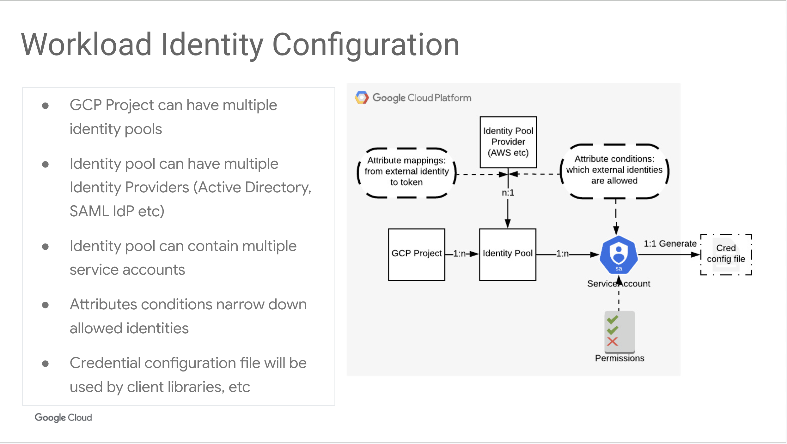
https://docs.google.com/presentation/d/1MMKXXvmcI88QQqggNXfYbwGQKAR-sgYVjtXdb3YAkzI/edit?usp=sharing


# Slide: Before 
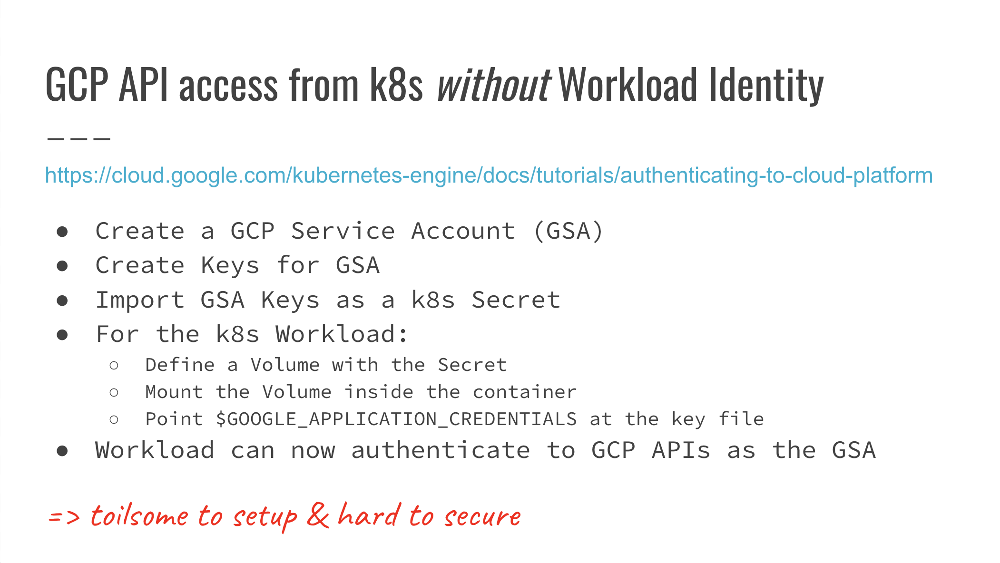
https://docs.google.com/presentation/d/1l0ekKHcCsSffuLfMnqXFVKxR73iEosXTMWnQuvu9Mgo/edit?usp=sharing


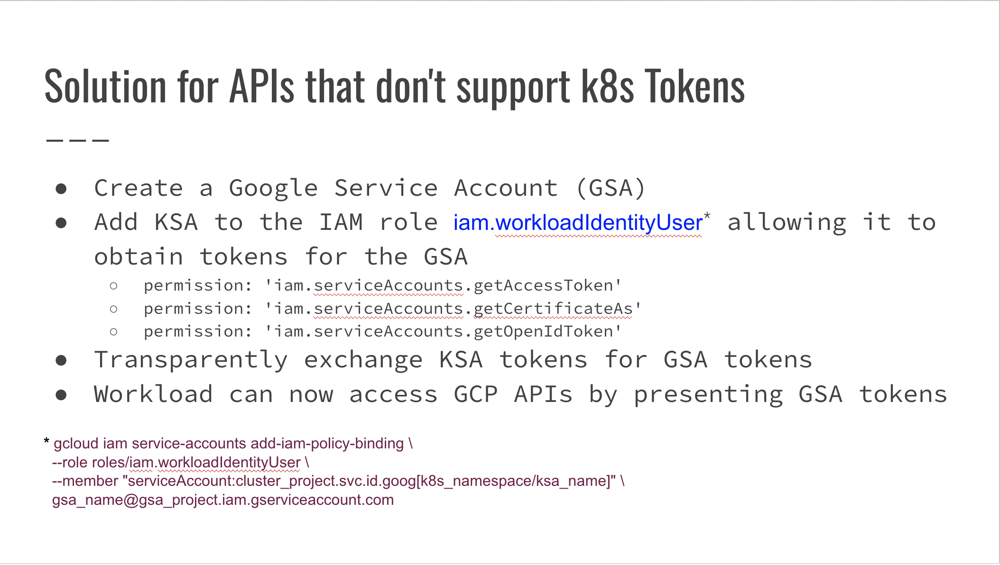

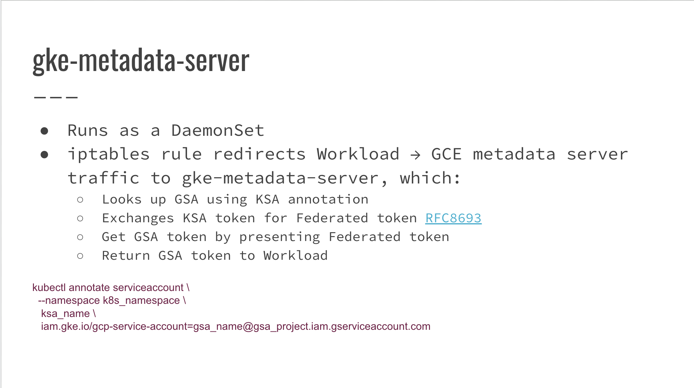

# hub/fleet
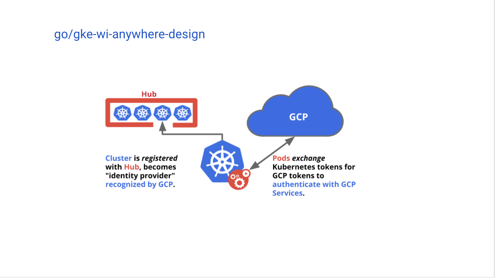
https://docs.google.com/presentation/d/1l0ekKHcCsSffuLfMnqXFVKxR73iEosXTMWnQuvu9Mgo/edit?usp=sharing

> [!info]+ explanation of diagrma
> n the architecture shown in the second image, "become identity provider" refers to the **GKE Cluster** itself acting as an OIDC (OpenID Connect) issuer that Google Cloud now "recognizes" as a trusted source of identity.
> 
> Specifically, it is a relationship between the cluster and the **Identity Service** (often managed via Hub/Anthos). Here is the breakdown:
> 
> ### 1. What "Identity Provider" means here
> 
> When a Pod wants to talk to Google Cloud, it presents a **Kubernetes Service Account (KSA) token**. For Google Cloud to accept that token, it needs to verify that the token is "real."
> 
> - The **GKE Cluster** is the "issuer" (the entity that signs the token).
>     
> - By registering with **Hub**, the cluster's public keys (OIDC discovery endpoint) are shared with Google's IAM system.
>     
> - This allows Google Cloud to treat the cluster as a legitimate **Identity Provider** for any workloads running inside it.
>     
> 
> ### 2. The Role of the Hub Service
> 
> The **Hub** (part of the Fleet management/Anthos ecosystem) acts as the **bridge**.
> 
> - It doesn't issue the tokens itself.
>     
> - Instead, it **registers** the cluster so that Google’s Security Token Service (STS) knows where to find the cluster's public keys to validate those Pod tokens.
>     
> 
> ### 3. The "Metadata Server" vs. "Identity Provider"
> 
> There is a slight distinction between the two:
> 
> - **The Identity Provider (Cluster):** This is the "Authority" that says, _"Yes, I created this Pod, and here is its ID token."_
>     
> - **The Metadata Server (GKE Node):** This is the "Messenger" running on the node. When your code calls a Google API, it asks the local Metadata Server for a token. The Metadata Server takes the Pod's KSA token, sends it to Google's STS, and brings back a Google Access Token.
>     
> 
> ---
> 
> ### Summary of the Flow in the Image
> 
> 1. **Registration:** You link the cluster to the **Hub**. Google now says, _"I know this cluster exists and I trust its signatures."_
>     
> 2. **Identity Provider:** The cluster is now an official **Identity Provider** in Google's eyes.
>     
> 3. **The Exchange:** A Pod uses its KSA token to prove its identity to Google. Because the cluster is a recognized provider, Google validates the token and swaps it for a Google Cloud token.
> 4

# Grokking Workload Identity (old?)
https://docs.cloud.google.com/kubernetes-engine/docs/how-to/workload-identity#kubernetes-sa-to-iam
local copy: https://docs.google.com/presentation/d/1l0ekKHcCsSffuLfMnqXFVKxR73iEosXTMWnQuvu9Mgo/edit?usp=sharing

## Kubernete Tokens exchanged for GCP Token
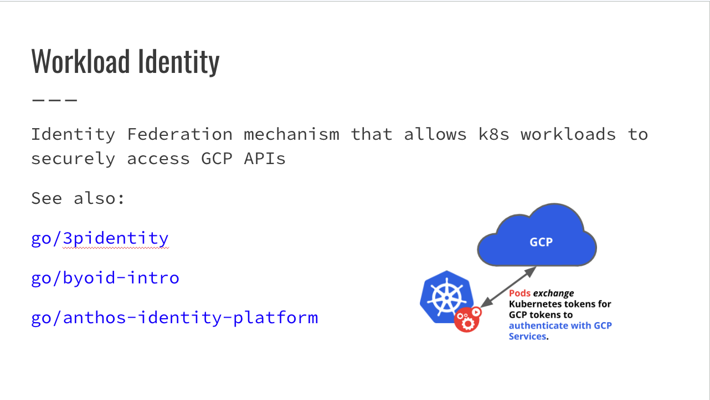

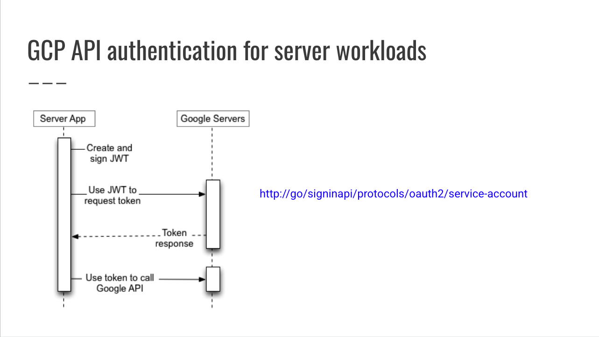
## Access token request and response:
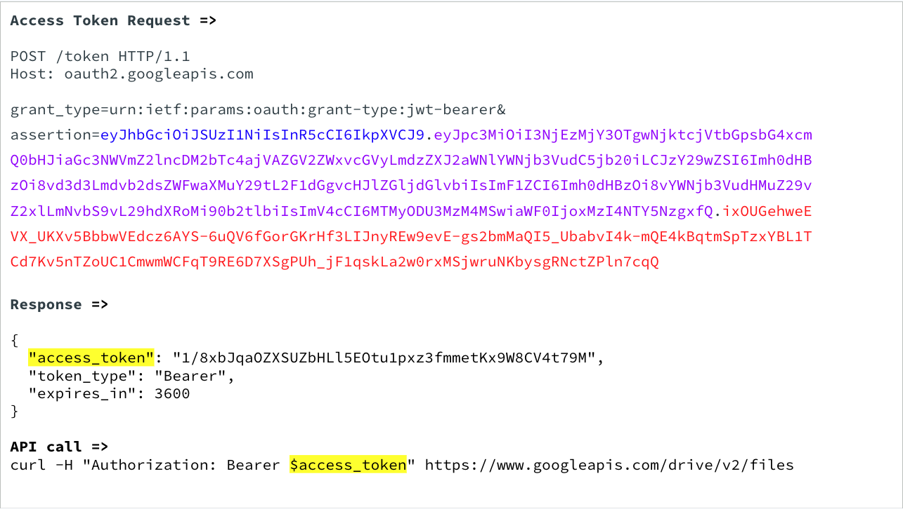
## Access without WI: Service Account Keys.
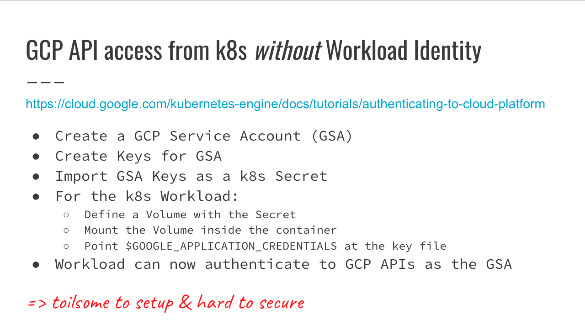
> [!Warning]+ 
> > long lived key, wide exposure: API server, any process within the Pod can read key


## API access with WI 2.0: KSA and GSA binding
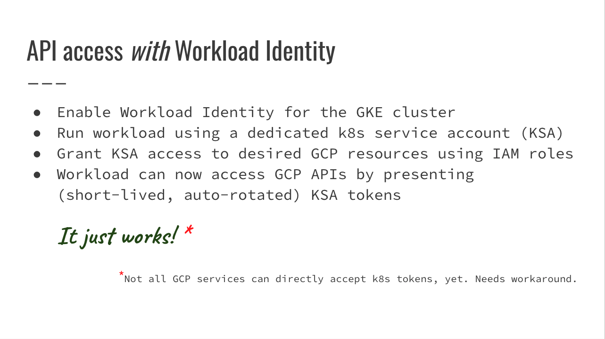
Enable Workload Identity for the GKE cluster
Run workload using a dedicated k8s service account (KSA)
Grant KSA access to desired GCP resources using IAM roles
Workload can now access GCP APIs by presenting (short-lived, auto-rotated) KSA tokens


## GKE metadata server
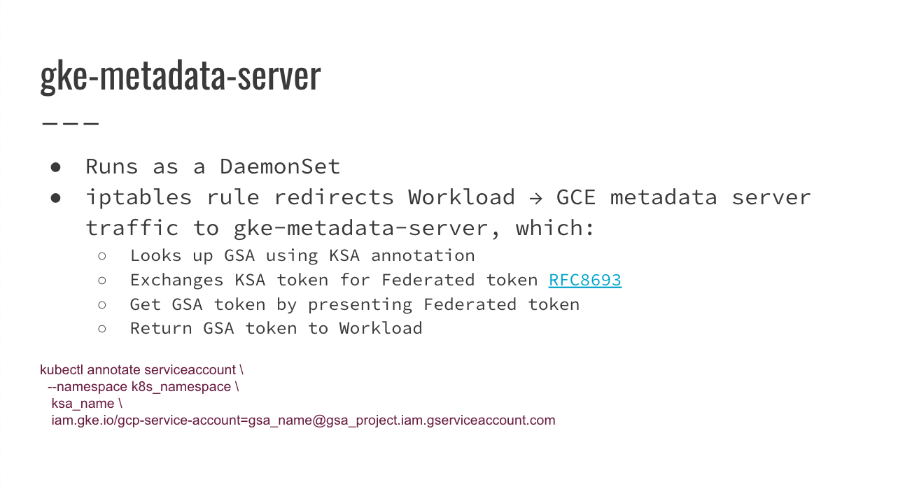

## gke anywhere
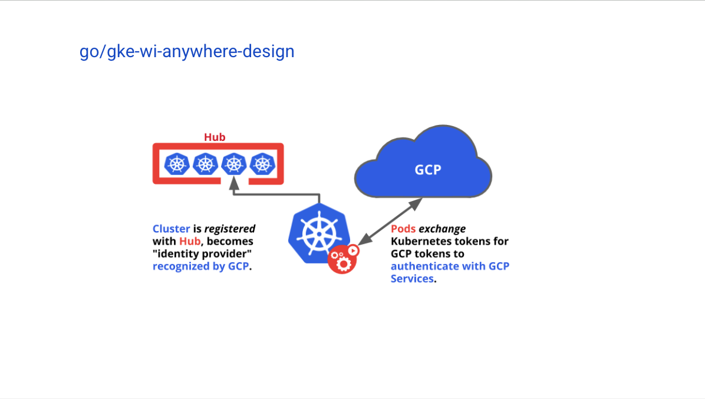
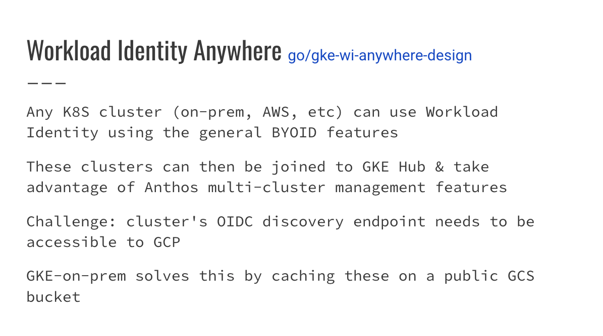

# Fleet and GKE WI 
> Q: if using gke workload identity federation, is there a benefit or need for joining the cluster to a fleet? cna the fleet become a Principal type then whereby any workloads in cluster belonging to the same fleet could use the same principla to which IAM permissions as assigned ?

> [!question]+ Q:
> Joining a cluster to a **Fleet** is the key to managing identity across multiple clusters, especially if they span different Google Cloud projects or environments.
> 
> ### The Benefit of Fleet Workload Identity
> 
> While standard Workload Identity Federation for GKE works at the **project level**, Fleet Workload Identity Federation extends this to a **fleet-wide level**.
> 
> - **Multi-Project Identity:** It allows a cluster in Project A and a cluster in Project B to share the same **Workload Identity Pool** (hosted in a central "fleet host" project).
>     
> - **Operational Simplicity:** You can define a single IAM policy for a specific Kubernetes Service Account (KSA) that applies to that KSA regardless of which cluster in the fleet it is running on.
>     
> - **Feature Enablement:** Some advanced multi-cluster features, like **Cloud Service Mesh** or **Multi-cluster Ingress**, require Fleet membership and Workload Identity to function correctly.
>     
> 
> ### Can a Fleet be a Principal Type?
> 
> A "Fleet" itself is not a direct principal type, but it enables the use of **Fleet-scoped principal identifiers**.
> 
> When you join a fleet, your workloads use the fleet host project's workload identity pool. You can then assign permissions to a **principalSet** that covers multiple clusters within that fleet.
> 
> #### Common Fleet Principal Syntaxes:
> 
> - **Specific KSA across the whole Fleet:** `principal://iam.googleapis.com/projects/FLEET_PROJECT_NUMBER/locations/global/workloadIdentityPools/FLEET_PROJECT_ID.svc.id.goog/subject/ns/NAMESPACE/sa/KSA_NAME`
>     
> - **All workloads in a specific Namespace across the whole Fleet:** `principalSet://iam.googleapis.com/projects/FLEET_PROJECT_NUMBER/locations/global/workloadIdentityPools/FLEET_PROJECT_ID.svc.id.goog/namespace/NAMESPACE`
>     
> 
> ---
> 
> ### Identity Sameness: The "Fleet" Principal Logic
> 
> The concept you are describing is called **Identity Sameness**. In a fleet, GKE assumes that if you have a namespace called `payment-prod` and a service account called `processor` in three different clusters, they represent the **same logical identity**.
> 


### Every workload of a fleet

from https://docs.google.com/presentation/d/1FzaC4Gpi2xprj6FFLfs6I41gx3qinKqcsQUmIUrcA04/edit?usp=sharing
those are the new KSA principals and princiapalset:

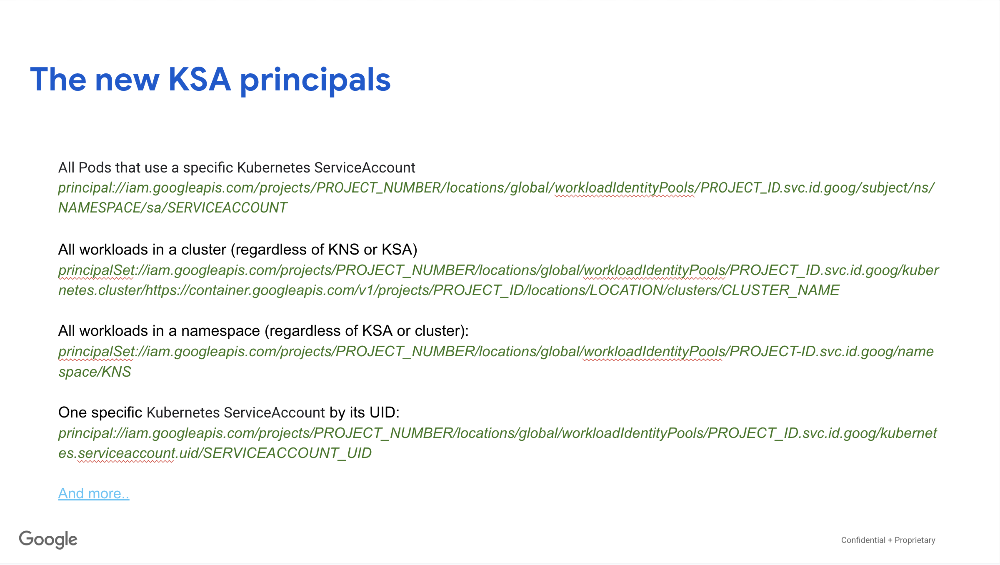
All workloads in a cluster (regardless of KNS or KSA)
principalSet://iam.googleapis.com/projects/PROJECT_NUMBER/locations/global/workloadIdentityPools/PROJECT_ID.svc.id.goog/kubernetes.cluster/https://container.googleapis.com/v1/projects/PROJECT_ID/locations/LOCATION/clusters/CLUSTER_NAME

All workloads in a namespace (regardless of KSA or cluster):
principalSet://iam.googleapis.com/projects/PROJECT_NUMBER/locations/global/workloadIdentityPools/PROJECT-ID.svc.id.goog/namespace/KNS

> 
> for clusters joined to a fleet, you can use a `principalSet` that covers **every workload in every cluster** within that fleet without specifying individual namespaces.
> 
> ### The Fleet-Wide Principal Syntax
> 
> When you want to grant a role to all authenticated identities within your fleet's workload identity pool, you use the following syntax:
> 
> `principalSet://iam.googleapis.com/projects/FLEET_HOST_PROJECT_NUMBER/locations/global/workloadIdentityPools/FLEET_HOST_PROJECT_ID.svc.id.goog/*`
> 
> By using the wildcard `*` at the end of the pool path, you are telling IAM: "Grant this permission to any workload that can successfully prove it belongs to a cluster in this fleet".
> 
> 
> ### Comparison of Principal Scopes
> 
> Using Fleet Workload Identity allows you to choose exactly how broad or narrow your permissions should be:
> 
>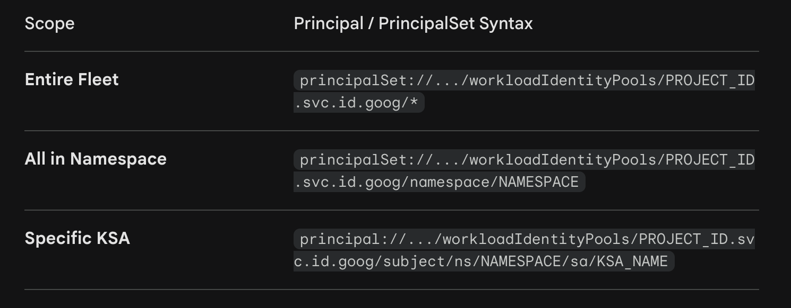


# Why dedicate GKE Node Service account
https://docs.cloud.google.com/kubernetes-engine/docs/how-to/protecting-cluster-metadata#service-account

Each node's service account credentials continue to be exposed to workloads. By default, your nodes use the [Compute Engine default service account](https://docs.cloud.google.com/compute/docs/access/service-accounts#default_service_account). You should configure a **minimally-privileged service account** for your nodes to use instead of the Compute Engine default service account. Then, attach this service account to your nodes, so that an attacker cannot circumvent GKE metadata protections by using the Compute Engine API to access the underlying VM instances directly.

## Still needed for image pulls

> [!quote]+ SA for image pull
> **Note:** Even with Workload Identity Federation for GKE configured on a cluster, GKE still uses the configured IAM service account for the node pool to pull container images from the image registry. If you encounter `ImagePullBackOff` or `ErrImagePull` errors, see [Troubleshoot image pulls](https://docs.cloud.google.com/kubernetes-engine/docs/troubleshooting/image-pulls).
> https://docs.cloud.google.com/kubernetes-engine/docs/concepts/workload-identity#credential-flow

## Firewall holes requirment with strict networkg policies
> [!Warning] +**Note:** If you have a strict [cluster network policy](https://docs.cloud.google.com/kubernetes-engine/docs/how-to/network-policy) in place, you must allow egress to the following IP addresses and port numbers so your Pod can communicate with the GKE metadata server. Allow egress to `169.254.169.252/32` on port `988`. For clusters running GKE Dataplane V2, ensure that you allowed egress to `169.254.169.254/32` on port `80`.

https://docs.cloud.google.com/kubernetes-engine/docs/concepts/workload-identity#token-lifetime
## Note about gke custom SA
The federated access token that's returned by Security Token Service might have limitations when trying to access some Google Cloud services, as described in [Supported products and limitations](https://docs.cloud.google.com/iam/docs/federated-identity-supported-services). If your selected Google Cloud service has limitations, you can optionally configure service account impersonation. This method results in an access token for an IAM service account that your workload can use to access the target service. For details, see [link Kubernetes ServiceAccounts to IAM](https://docs.cloud.google.com/kubernetes-engine/docs/how-to/workload-identity#kubernetes-sa-to-iam).
https://docs.cloud.google.com/kubernetes-engine/docs/concepts/workload-identity#credential-flow
## Metadata concealement (old, replaced by WI)

> [!warning]+ no longer use metadata concealement
> Warning: Workload Identity Federation for GKE replaces the need to use metadata concealment and the two approaches are incompatible. We recommend that you use Workload Identity Federation for GKE instead of metadata concealment.


link 1: https://docs.cloud.google.com/kubernetes-engine/docs/concepts/workload-identity#what_is
and 
link 2 refererred by link1: https://docs.cloud.google.com/kubernetes-engine/docs/how-to/protecting-cluster-metadata#concealment

[link 1:](https://docs.cloud.google.com/kubernetes-engine/docs/concepts/workload-identity#what_is)
Workload Identity Federation for GKE replaces the need to use [Metadata concealment](https://docs.cloud.google.com/kubernetes-engine/docs/how-to/protecting-cluster-metadata). The sensitive metadata protected by metadata concealment is also protected by Workload Identity Federation for GKE.


[link2:](https://docs.cloud.google.com/kubernetes-engine/docs/how-to/protecting-cluster-metadata#concealment)
GKE _metadata concealment_ prevents user Pods from accessing `kube-env`, which contains kubelet credentials, and the VM's [instance identity token](https://docs.cloud.google.com/compute/docs/instances/verifying-instance-identity).


Metadata concealment firewalls traffic from user Pods (Pods _not_ running on `HostNetwork`) to the cluster metadata server,

The firewall prevents user Pods from using kubelet credentials for privilege escalation attacks, or from using VM identity for instance escalation attacks.

Workload Identity Federation for GKE replaces the need to use metadata concealment and expands on the protections that metadata concealment offers. You should use Workload Identity Federation for GKE instead of metadata concealment in all situations. To learn more, see [About Workload Identity Federation for GKE](https://docs.cloud.google.com/kubernetes-engine/docs/concepts/workload-identity).

## Wokload use of Node service account via metadata inheritence
workloads **can** leverage the underlying node service account, but they do so via **metadata inheritance**, not usually through explicit impersonation.


When you attach a service account (SA) to a GKE cluster, you are actually attaching it to the **Compute Engine VMs** (nodes) that make up the cluster.

By default, any pod running on that node has access to the **Compute Engine Metadata Server**.


<font color="#ff0000">When a workload (like a Python script using a Google Cloud SDK) requests an authentication token, it calls the metadata server. Because the pod is running on the VM, the metadata server returns the token for the service account</font> attached to that VM

## WI Metadata interceptor: intercepts request to GCP API metadata IP
With Workload Identity, you link a **Kubernetes Service Account (KSA)** to a **Google Service Account (GSA)**.

How it works:

1. **Identity Mapping:** You tell GKE that `namespace/my-ksa` is allowed to act as `my-gsa@project.iam.gserviceaccount.com`.
    
2. **The Metadata Interceptor:** GKE runs a "GKE Metadata Server" on each node. When a pod asks for a token, this server intercepts the request.
    
    +1
    
1. **Token Exchange:** Instead of giving the pod the _node's_ token, it verifies the pod's Kubernetes identity and issues a short-lived token specifically for the linked GSA.
2. 


Here is the breakdown of how it is deployed and how it "intercepts" requests:

### 1. Where is it running?

The GKE Metadata Server runs as a **DaemonSet** on the **worker nodes** (not the control plane).

- **The Pod:** You will see it in the `kube-system` namespace, usually named something like `gke-metadata-server`.
    
- **The Scope:** Because it is a DaemonSet, one instance runs on every single worker node in your cluster (or node pool) where Workload Identity is enabled.
    

### 2. Is the "interceptor" a separate pod?

No, the "interceptor" and the "metadata server" are the **same thing**. The "interceptor" is actually a networking rule (IP tables) that redirects traffic.

Here is the flow of how the interception happens:

1. **The Request:** A workload pod tries to talk to the standard Google Cloud Metadata IP address: `169.254.169.254`.
    
2. **The Redirection:** On the worker node, **IP table rules** (managed by GKE) catch any traffic destined for `169.254.169.254`.
    
3. **The Handoff:** Instead of letting that traffic go out to the real GCE Metadata Server (the VM's identity), the rules route it locally to the **GKE Metadata Server pod** running on that same node.
    
4. **The Validation:** The GKE Metadata Server pod looks at the incoming request, identifies which Pod sent it (via its local IP), checks if that Pod's **Kubernetes Service Account (KSA)** is mapped to a **Google Service Account (GSA)**, and then fetches the correct token.


# !!!! Workload IDentify + no customer SA but GCE SA.

**Yes**, if Workload Identity is enabled but a specific Pod lacks an IAM binding (via a KSA principal), that Pod can still theoretically "fall back" to using the node’s underlying service account (GCE SA), but **only if the cluster is not configured to block it.**

## 1. The Fallback Behavior

When you enable Workload Identity (WI) on a cluster, GKE deploys the **GKE Metadata Server** to intercept requests. However, the system distinguishes between two types of Pods:

- **Bound Pods:** Pods using a KSA that has been annotated and granted the `roles/iam.workloadIdentityUser` role. These Pods get a token for the specific **Google Service Account (GSA)** you chose.
    
- **Unbound Pods:** Pods using a standard KSA with no IAM binding. By default, these Pods will see the **Node's Service Account** (whether it's the default GCE SA or a custom "least privilege" one you assigned to the cluster).
    

> **Wait, why?** This is designed for backward compatibility. Google doesn't want to break existing logging or monitoring agents that rely on the node's identity when you turn on WI for your applications.

## 2. The Risks of the "Unbound" State

If you have a cluster with the **Default GCE Service Account** (which has the "Editor" role by default) and you enable Workload Identity:

- An attacker or an unconfigured Pod can still call the metadata server.
    
- Because no WI binding exists for that Pod, the GKE Metadata Server "shrugs" and hands over a token for the **Node's Service Account**.
    
- If that node SA is the default GCE one, your "unbound" Pod now has **Editor** permissions over your entire project.

## 3. How to Prevent the Fallback

If you want to ensure that Pods **cannot** use the node's service account and _must_ use Workload Identity, you have two main options:

### Option A: Use a Dedicated Least-Privilege Node SA

As you mentioned, when creating the cluster, specify a custom GSA for the nodes that has **zero** extra permissions (it only needs `logging.logWriter`, `monitoring.metricWriter`, and `artifactregistry.reader`). Even if a Pod "falls back" to this identity, it can't do any damage to your other Cloud resources.


you are exactly right. The `roles/container.defaultNodeServiceAccount` role is the modern, pre-packaged "least privilege" role designed specifically for GKE nodes.

It was created to replace the over-privileged **Compute Engine default service account** (which often has the `Editor` role) and bundles together the exact permissions a node needs to function properly.

##### 1. What's Inside the Role?

The `roles/container.defaultNodeServiceAccount` role includes the following essential permissions:

- **`logging.logWriter`**: Allows the node to send system and workload logs to Cloud Logging.
    
- **`monitoring.metricWriter`**: Allows the node to send metrics (like CPU and memory usage) to Cloud Monitoring.
    
- **`monitoring.viewer`**: Allows the node to retrieve monitoring data.
    
- **`stackdriver.resourceMetadata.writer`**: Helps associate logs and metrics with the correct GKE cluster resources.
    

##### 2. The "Artifact Registry" Nuance

While this role covers **logging** and **monitoring**, it does **not** always automatically include permission to pull from _private_ repositories in Artifact Registry.

- **Same Project:** If your Artifact Registry is in the **same project** as your GKE cluster, nodes can often pull images by default via internal service agent permissions.
    
- **Cross-Project or Hardened:** If you are pulling from a different project or have a highly restricted environment, you must **explicitly add** the `roles/artifactregistry.reader` role to your custom service account.


### Option B: Metadata Concealment (Legacy) / GKE Hardening

In older GKE versions, "Metadata Concealment" was used. Today, the standard is to ensure all workloads are migrated to Workload Identity and to use **Network Policies** to block egress to the metadata IP (`169.254.169.254`) for any Pod that shouldn't be talking to Google APIs at all.


## Q: Best practice: no firewall needed... 
You are absolutely correct. From a **least-privilege** architectural standpoint, using a custom, restricted Service Account for your nodes is the most robust "fail-safe."

If your node's Service Account only has permissions for logging, monitoring, and reading images, then even if a Pod "falls back" to that identity, it is effectively neutered—it cannot delete buckets, modify DNS, or access sensitive secrets in Secret Manager.

However, there are three specific reasons why security architects still sometimes use **Network Policies** or **Metadata Concealment** even when using a restricted Node SA:

### 1. Reducing the "Discovery" Surface Area

Even a restricted Service Account can still be used to "enumerate" or "discover" things. An attacker who gains access to a Pod can query the metadata server to find out:

- The Project ID.
    
- The Cluster Name and Location.
    
- The Node's internal IP and Hostname.
    
- The Node's Identity Token (JWT). While they can't _delete_ anything with these, this information is gold for "lateral movement" (planning the next step of an attack). Blocking the IP `169.254.169.254` makes the Pod "blind" to the cloud environment entirely.
    

### 2. Preventing "Token Theft"

If a Pod doesn't need to talk to _any_ Google APIs (e.g., a simple Nginx frontend), allowing it to reach the metadata server creates an unnecessary risk. If that Nginx Pod is compromised via a web vulnerability, the attacker can grab a valid OAuth2 token for the node. Even if that token only allows "Logging," the attacker could potentially flood your logs with junk data to drive up costs or hide their tracks (a "Log Injection" attack).

### 3. Defense in Depth

In security, we assume one layer will eventually fail.

- **Layer 1:** Workload Identity (Identity-based).
    
- **Layer 2:** Restricted Node SA (IAM-based).
    
- **Layer 3:** Network Policy (Network-based).
    

If someone accidentally attaches the `Editor` role back to the Node SA (it happens more often than you'd think during "emergency troubleshooting"), the **Network Policy** is the only thing left standing between a compromised Pod and your entire Google Cloud project.


# Documentation

## Conditional IAM Policies
Note: Conditional IAM policies: e.g. time expiration
	- https://docs.cloud.google.com/kubernetes-engine/docs/concepts/workload-identity#use-iam-conditions
	- 

## REference k8s resource/workload in policy: KSA principal
https://docs.cloud.google.com/kubernetes-engine/docs/concepts/workload-identity#kubernetes-resources-iam-policies


### 1.All Pods that use a specific Kubernetes ServiceAccount
### 2.All Pods in a namespace, regardless of service account or cluster
### 3. All Pods in a specific cluster

### See other principals
[[#Other KSA Principals]]


# How ADC Finds Credentials

When your application calls a Google Cloud service, the client library searches for a credential in the following order of priority:

1. **Environment Variable:** It first checks for the `GOOGLE_APPLICATION_CREDENTIALS` environment variable, which should point to a JSON service account key file.
    
2. **User Credentials (Local):** If the environment variable isn't set, it looks for credentials created via the Google Cloud CLI (using `gcloud auth application-default login`).
    
3. **Attached Service Account (Cloud):** If neither of the above is found, it queries the **Metadata Server** of the Google Cloud environment where the code is running (such as GKE, Compute Engine, or Cloud Run) to use the identity attached to that resource.
    

---

### ADC in the Context of GKE

As seen in the diagram you provided, the flow for GKE specifically leverages the third step of the ADC strategy:

- **The Request:** The workload (using a client library) makes a request to the metadata server for a token.
    
- **The Interception:** Because Workload Identity is enabled, the **GKE Metadata Server** intercepts this ADC request.
    
- **The Exchange:** It then performs the "Federated identity token flow" by getting a Kubernetes JWT and exchanging it for a Google Cloud token via the Security Token Service.
    

### Why use ADC?

- **Portability:** You can write code on your laptop using your user identity and deploy it to GKE where it automatically switches to using a Service Account identity without any code changes.
    
- **Security:** It encourages the use of short-lived tokens and metadata-based identities rather than long-lived, high-risk JSON key files.
    

**Would you like me to show you how to set up the `GOOGLE_APPLICATION_CREDENTIALS` variable for local testing?**


## JWT TOKEN
> [!question]+ key file 
> Q: how is a JSON service account key file used when using the GOOGLE_APPLICATION_CREDENTIALS variable of the client application? it will submit API requests to the google services with an HTTP bearer-token which content is a JWT signed with the json private key, allowing the GCP service to validate the identity of the signer of the JWT token using the public key they kept in file for the service account tied to the key? 

A:
You’ve nailed the core logic of the cryptographic handshake, but there is one nuance in how the token is actually used in the HTTP request.

When you use a **JSON service account key file** via the `GOOGLE_APPLICATION_CREDENTIALS` environment variable, the process doesn't usually send the "Self-Signed JWT" directly to the target service (like Cloud Storage or Pub/Sub). Instead, it follows a two-step "Token Exchange" process.


## 1. The OAuth2 Flow (The Standard Way)

For most Google Cloud APIs, the client library uses the private key to request a short-lived **Access Token**.

1. **JWT Construction:** The client library creates a JWT (JSON Web Token) locally. The header specifies the algorithm (RS256), and the payload includes the service account's email, the "scopes" (permissions) requested, and the expiration time.
    
2. **Signing:** The library signs this JWT using the **Private Key** found in your JSON file.
    
3. **The Exchange:** The library sends this signed JWT to the **Google OAuth2 Authorization Server** (`oauth2.googleapis.com`).
    
4. **Validation:** Google’s server uses the **Public Key** (which it stores) to verify the signature. If valid, it returns an **opaque Access Token** (usually starting with `ya29...`).
    
5. **The API Request:** Your application then attaches this Access Token to the HTTP header of the actual request:
    
    `Authorization: Bearer <access_token>`
    

---

## 2. Service Account "Self-Signed" JWTs (The Exception)

There is a second method, which aligns more closely with what you described, where the JWT is sent **directly** to the service without an exchange step. This is often used for:

- **Google Cloud Functions** or **Cloud Run** (OIDC tokens).
    
- **Firebase** or certain specific API endpoints that support JWT-based authentication.
    

In this scenario:

1. The client library signs a JWT where the `aud` (audience) field is the specific URL of the service you are calling.
    
2. The library attaches this **Signed JWT** directly to the HTTP header: `Authorization: Bearer <signed_jwt_content>`
    
3. The receiving service (e.g., your Cloud Run endpoint) validates the signature immediately using Google's public keys.

# Every workload needs a KSA
Q: in gke workload workload identity, if we plan to use the principal that allows any workload on the cluster to authenticate with IAM permission we granted to that principal. Do the workload still need a KSA? they alway do right?

To answer your question simply: **Yes**, every workload on GKE still requires a **Kubernetes Service Account (KSA)**, even if you are using a broad "all-workloads-in-cluster" principal.

While the new **Workload Identity Federation for GKE** allows you to grant permissions to entire groups of pods at once, the underlying authentication mechanism still relies on the KSA as the fundamental unit of identity.

### 1. Why a KSA is Always Required

Even if you define an IAM policy that says "grant permissions to every pod in this cluster," the **GKE Metadata Server** still needs to know who is making the request.

- **The Identity Token:** Every pod must present a **Service Account Token** (signed by the Kubernetes API Server) to the metadata server.
    
- **The Default:** If you don't explicitly assign a KSA in your Pod spec, Kubernetes automatically assigns the `default` KSA in that namespace. Therefore, even a pod without a custom KSA technically "has" a KSA.
    

### 2. Using the "Broad" Principal

Google Cloud IAM now supports **`principalSet`** notation. This allows you to grant a role to a group of identities without individual bindings.

+1

If you want **any workload in your cluster** to have a specific permission, you can grant the role to this principal format:

> `principalSet://iam.googleapis.com/projects/PROJECT_NUMBER/locations/global/workloadIdentityPools/PROJECT_ID.svc.id.goog/kubernetes.cluster/https://container.googleapis.com/v1/projects/PROJECT_ID/locations/LOCATION/clusters/CLUSTER_NAME`

**The result:** Any pod in that cluster (regardless of its KSA name or namespace) will inherit that permission when it calls a Google API through the metadata server.

### 3. Direct Access vs. Impersonation

There are now two ways to handle this broad permission:

- **Direct Access (New/Modern):** You grant the IAM role (e.g., `roles/storage.objectViewer`) **directly** to the cluster-wide `principalSet` described above.
    
- **Impersonation (Legacy):** You grant the `roles/iam.workloadIdentityUser` role on a specific **Google Service Account (GSA)** to the cluster-wide `principalSet`. In this case, every pod in the cluster is allowed to "act as" that specific GSA.

### impersonation vs no impersonation (KSA)
When you choose **not** to use service account impersonation, the identity of the request is the **Kubernetes Service Account (KSA)** itself, acting as a direct principal in Google Cloud.

If you **do** use impersonation, you are impersonating a specific **Google Service Account (GSA)** that you have created, **not** the Node's service account.

---

#### 1. The "Principal" Without Impersonation

When you skip impersonation, the "Who am I?" of the request is a federated identity that looks like this in the eyes of Google IAM:

> `principal://iam.googleapis.com/projects/PROJECT_NUMBER/locations/global/workloadIdentityPools/PROJECT_ID.svc.id.goog/subject/ns/NAMESPACE/sa/KSA_NAME`

- **How it works:** You grant IAM roles (like `roles/storage.objectViewer`) **directly** to this long string.
    
- **The Advantage:** It is simpler because you don't need to manage a separate GSA.
    
- **The Limitation:** Some older Google Cloud services do not recognize this "federated" principal format and expect a traditional Google Service Account email address.
    

#### 2. The "Impersonation" Target

If a service (like certain older Cloud APIs) doesn't support the federated principal, you use the KSA to "impersonate" a **Google Service Account (GSA)**.

- **The Target:** You create a GSA (e.g., `my-app-sa@project.iam.gserviceaccount.com`).
    
- **The Binding:** You grant the KSA permission to "act as" that GSA using the `roles/iam.workloadIdentityUser` role.
    
- **The Result:** The GKE Metadata server performs an extra exchange step to get a token for that **GSA**. The target service sees the request coming from the GSA email, not the KSA string.

### Impersonation 2.0

#### 1. The Distinction: Impersonation vs. Direct Access

You are correct that the identities listed in the documentation (like `principal://iam.googleapis.com/...`) are the core identifiers, but how you use them determines if impersonation is involved:

- **Direct Resource Access (Modern/Default Recommendation):** You grant IAM roles (e.g., `roles/storage.objectViewer`) **directly** to the Kubernetes principal identifier. In this case, there is **no GSA** and **no impersonation**; the Kubernetes identity is treated as a first-class citizen by Google Cloud IAM.
    
- **Service Account Impersonation (Legacy/Alternative):** You grant the `roles/iam.workloadIdentityUser` role to the Kubernetes principal on a specific **Google Service Account (GSA)**. The workload then "impersonates" that GSA to inherit its permissions.
    

#### 2. The Kubernetes Principals

The principals you referenced are indeed the "who" in the IAM binding. They use the **Workload Identity Pool** (`PROJECT_ID.svc.id.goog`) to represent your cluster identities.

Common principal formats include:

- **Specific KSA:** `principal://iam.googleapis.com/projects/PROJECT_NUMBER/locations/global/workloadIdentityPools/PROJECT_ID.svc.id.goog/subject/ns/NAMESPACE/sa/KSA_NAME`
    
- **Entire Namespace:** `principalSet://iam.googleapis.com/projects/PROJECT_NUMBER/locations/global/workloadIdentityPools/PROJECT_ID.svc.id.goog/attribute.kubernetes_namespace/NAMESPACE`
    

#### 3. Why move away from Impersonation?

Google now recommends the **Direct Access** model for most cases because:

- **Simplicity:** It removes the need to manage a "shadow" GSA for every KSA, reducing identity sprawl.
    
- **Better Auditing:** Cloud Audit Logs directly show the Kubernetes identity (Namespace/KSA) performing the action rather than the impersonated GSA.
    
- **Easier Management:** No more annotating Kubernetes Service Accounts with GSA email addresses.

# gcloud auth login --update-adc

Q: so when as a user i authenticate to my gcp org using gcloud auth login 
and use my user email address and and go thru the access code validation. When i use the command with --update-adc... is sets an environment variable for application-default? (gcloud auth application-default login) so when an application need to call out an api, it will do so using permission granted to my user account? 

A: 
Exactly. You have the "Two Wallets" concept perfectly mapped out.

When you run `gcloud auth login --update-adc`, you are effectively filling both wallets at the same time.

---

### 1. The Environment Variable Myth

A common point of confusion is whether these commands set an environment variable.

- **No**, `gcloud auth application-default login` (and the `--update-adc` flag) **does not** set the `GOOGLE_APPLICATION_CREDENTIALS` environment variable.
    
- Instead, it saves a JSON file to a **"well-known location"** on your hard drive.
    
- Google's client libraries (Python, Go, Node.js, etc.) and tools like **Terraform** are hardcoded to look in that specific folder if no environment variable is found.
    

**Well-known locations:**

- **Linux/macOS:** `~/.config/gcloud/application_default_credentials.json`
    
- **Windows:** `%APPDATA%\gcloud\application_default_credentials.json`


### 2. User Account Permissions

Yes, once ADC is configured with your user account, any application using the Google Cloud SDK on your machine will act with **your personal IAM permissions**.

- **The Scope:** By default, these credentials have the `cloud-platform` scope, meaning they can do anything your user is allowed to do in the Google Cloud Console.
    
- **The Quota Catch:** Some APIs (like BigQuery) might fail with a "quota" error even if you have permission. This is because ADC needs to know which project to "bill" for the API call. You often need to run:
    
    `gcloud auth application-default set-quota-project PROJECT_ID`
    


## Worklaod will ont be authed as the user
so the distinction betwen my seting application-default login crednetial using my own user credentials for tasks such as terraform lead by those clients, and a workload on GKE, is that the GKE workload will not that json from me being authenticalted on the workload since the workload needs their own identity and IAM permissions. Hence the roe of workload identity and the metadata server as the token exchanger 


A: 
That is exactly right. You’ve hit on the fundamental shift from **User-centric** development to **Workload-centric** production security.

Here is the breakdown of why that distinction exists and how the roles change:

---

### 1. The Development Context (Local Machine)

When you run `gcloud auth application-default login` on your laptop, you are creating a "temporary bridge" so that tools like Terraform can act on your behalf.

- **The Identity:** It is **you** (your user email).
    
- **The Storage:** The credentials live in a JSON file on your local disk.
    
- **The Risk:** If you were to copy that JSON file into a Docker image and deploy it to GKE, you would be giving that workload all of **your personal permissions**. If the pod is compromised, the attacker becomes **you**.
    

### 2. The Production Context (GKE)

In GKE, we want the workload to have its own "passport" that is independent of any human user.

- **No JSON Files:** We do not want to manage, rotate, or protect long-lived secret files inside a cluster.
    
- **Workload Identity:** This allows the pod to "prove" it belongs to a specific Kubernetes Service Account (KSA).
    
- **The Token Exchanger:** The **GKE Metadata Server** acts as the trusted middleman. It tells Google IAM: _"I have verified this Pod is who it says it is; please give it a temporary Google Cloud token so it can do its job"_.
## Auth flow
https://docs.cloud.google.com/kubernetes-engine/docs/concepts/workload-identity#credential-flow


### GCE Metadata server?
The **Compute Engine metadata server** is a specialized, internal service that is **local to each virtual machine (VM) host**.

It is not an "external" service in the sense of a public API endpoint over the internet; rather, it is a service provided by the underlying Google Cloud infrastructure specifically for the VM.

#### How the GCE Metadata Server Exists

- **Physical Location:** When your application makes a metadata request, the traffic never actually leaves the **physical host** (the hardware) that is running your VM.
    
- **IP Address:** Every VM can access it at the same "link-local" IP address: `169.254.169.254`.
    
- **Internal DNS:** It is also accessible via the hostname `metadata.google.internal`.
    

#### The Metadata Server in a GKE Context

In a standard VM, your application talks directly to this GCE metadata server to get its identity (the VM's service account).

However, when you enable **Workload Identity** in GKE, the process changes to improve security and granularity:

1. **The Interceptor:** GKE deploys a **GKE metadata server** (as a pod/DaemonSet) on every worker node.
    
2. **Redirection:** GKE uses network rules (`iptables`) to catch any traffic going to `169.254.169.254`.
    
3. **Substitution:** Instead of the request reaching the "real" GCE metadata server (which only knows the VM's identity), it is intercepted by the **GKE metadata server**.
    
4. **Identity Exchange:** This GKE-specific server verifies the Pod's Kubernetes identity and fetches a token for the specific **Google Service Account** you mapped to that workload, rather than just returning the node's account.


### GCE SA and permission for workload token
Q: so without workload identity, the gke workload/pod makes the request to the GCE metadata server, the metadata server will provide a token to the workload for it to make the call to the goole api using the GCE instance service account correct? and then whether or not the workload can access the aPI depends on the IAM permission associated with the GCE SA correct?

Correct. Your understanding of the legacy behavior (without Workload Identity) is spot on.

#### 1. The Legacy Authentication Flow

When Workload Identity is **not** enabled:

- **Direct Access:** The GKE pod makes a request directly to the standard **Compute Engine (GCE) metadata server**.
    
- **Node Identity:** The metadata server responds by providing the token for the **Service Account attached to the VM instance (the node)**.
    
- **Shared Identity:** Because all pods on a single node share the same underlying VM, every pod on that node defaults to using that same single GCE service account identity.
    

#### 2. The Authorization Check

- **IAM Logic:** When the workload uses that token to call a Google API (like Cloud Storage), Google Cloud's IAM checks the permissions of the **GCE node service account**, not the specific pod.
    
- **Access Control:** If the node's service account has the `Storage Object Viewer` role, **every pod** on that node can read from your buckets. If it has `Editor`, every pod can delete resources in your project.
    

#### 3. Why this is a Security Risk

This legacy "Node Identity" model is generally discouraged for two reasons:

1. **Violation of Least Privilege:** You often have different apps on the same node; one might need database access while another only needs to write logs. Under this model, you are forced to give the node _both_ sets of permissions, exposing them to every pod.
    
2. **Broad Blast Radius:** If a single web-facing pod is compromised, the attacker instantly inherits the full permissions of the node's service account to move laterally through your cloud environment.

## !!!!! Bearer token: signed JWT vs Opaque OAuth2 token
Q: the workload making the call to the Google Service like Google cloud storage for example will send the HTTP request with a bearer token that is a json JWT token correct? signed with the private of the GCE service account?


Actually, no—the bearer token used to call Google APIs like Cloud Storage is **not** typically the self-signed JWT from the GCE service account.

While you _can_ use a self-signed JWT for some specific APIs, the standard and most common "bearer token" is an **opaque OAuth2 Access Token**.

### 1. The Real Token Format: Opaque vs. JWT

When your workload (using the Cloud SDK or `curl`) asks the GCE Metadata Server for a token, the server returns an **access token**.

- **Appearance:** These tokens usually start with `ya29...`.
    
- **Format:** Unlike a JWT, which you can decode at [jwt.io](https://jwt.io), a standard Google access token is **opaque**. This means you cannot decode it yourself to see the internal data; only Google's internal systems know what is inside.
    
- **The Request:** When you call Cloud Storage, you attach it like this: `Authorization: Bearer ya29.AHES6ZRN3...`
    

### 2. Who Signs the Token?

You mentioned the "private key of the GCE service account." <font color="#ff0000">This is where the distinction between **GCE Metadata Server** and **JSON Key Files** is important</font>:

- **Using GCE Metadata Server:** You never see a private key. Google manages the keys internally. The Metadata Server generates the access token for you.
    
- **Using a JSON Key File:** In this specific case, your application _does_ use the private key from the JSON file to sign a **JWT locally**. But then, the SDK typically sends that JWT to Google’s OAuth server to **exchange it** for the opaque `ya29...` access token before calling the storage API.
    

### 3. "Service Account Authorization without OAuth" (The Exception)

There is a "direct" method where you _can_ send a signed JWT directly as a bearer token.

- **How it works:** You sign a JWT using the service account private key.
    
- **The Header:** You send that raw JWT in the `Authorization: Bearer <JWT>` header.
    
- **The Catch:** This only works for certain APIs and requires your SDK to be specifically configured for it (often called `UseJWTAccessWithScope`). It is rarely used compared to the standard OAuth2 access token.


## token proivded by the gke metadata server (exchange of k8s JWT token): Oauth 2.0 opaque

when it says "The GKE metadata server uses Security Token Service to exchange the JWT for a short-lived federated access token that references the identity of the Kubernetes workload.", the federated access token mentioned here would be an Oauth2 opaque token correct?

Yes, you are correct. The **federated access token** issued by the Google Security Token Service (STS) is an **opaque OAuth 2.0 access token**.

While the "input" to this exchange is a transparent **JSON Web Token (JWT)** from the Kubernetes API server, the "output" from the STS is intentionally opaque so it cannot be inspected or decoded by the client application.

### 1. Token Format and Characteristics

- **Format**: It is a proprietary, random-looking string of alphanumeric characters. It does not follow the three-part `header.payload.signature` structure of a JWT.
    
- **Introspectability**: Unlike a JWT, you cannot decode it to see its claims (like who the user is or when it expires) without sending it back to a Google validation endpoint.
    
- **Security**: Because it is opaque, it does not reveal any internal information about your cluster or workload identity if intercepted.

### 2. The Two-Step Exchange Flow

It is helpful to see exactly where the transition from "transparent" to "opaque" happens in the Workload Identity flow:
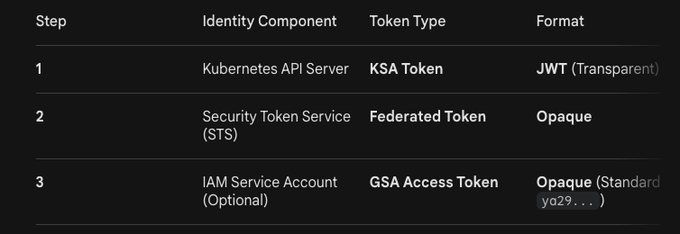
### 3. Usage of the Federated Token

The federated token itself can be used as a `Bearer` token in the `Authorization` header to call Google APIs directly, provided the **Workload Identity Principal** (the KSA) has been granted direct IAM roles on those resources.

However, in many configurations, this federated token is immediately used for a **second exchange** to impersonate a specific Google Service Account (GSA). This second exchange also results in an **opaque** access token.

> [!quote]+ GSA instead
> If your selected Google Cloud service has limitations, you can optionally configure service account impersonation. This method results in an access token for an IAM service account that your workload can use to access the target service. For details, see [link Kubernetes ServiceAccounts to IAM](https://docs.cloud.google.com/kubernetes-engine/docs/how-to/workload-identity#kubernetes-sa-to-iam).
https://docs.cloud.google.com/kubernetes-engine/docs/concepts/workload-identity#credential-flow

# Initial Workload sdk request for auth token

Q:
initially, the workload on gke does not know about the whole Workload identity flow.... all it knows is that it needs to get a token for its request to a google cloud service api, an oauth token it can attach to its request auth header. 
the google cloud sdk libary dictates where to go for a request of such token and it will default to 169.254.169.254 correct? 

A: 
Exactly. You have the "entry point" of the process perfectly described.

The workload itself remains **"identity-agnostic."** It doesn't need special code for GKE, AWS, or a local server. It simply asks the standard library for a token, and the library follows a hardcoded treasure map to find one.

### 1. The SDK's Hardcoded Destination

When you use a Google Cloud client library (the SDK) without a manual JSON key file, it initiates the **Application Default Credentials (ADC)** search.

- **The Default Target:** If no local credentials or environment variables are found, the library assumes it is running on Google Cloud infrastructure.
    
- **The IP Address:** It sends an HTTP request to the "link-local" IP address **`169.254.169.254`**.
    
- **The Hostname:** It may also try the internal hostname `metadata.google.internal`, which resolves to that same IP.
    

### 2. The Illusion of the GCE VM

From the perspective of your application's code:

- It thinks it is talking to a standard **Compute Engine VM metadata server**.
    
- It asks for a token at the standard path: `/computeMetadata/v1/instance/service-accounts/default/token`.
    
- It expects a response containing an OAuth2 access token.
    

### 3. The "Silent" GKE Handover

This is where the GKE "magic" happens behind the scenes without the workload ever knowing:

1. **Interception:** Instead of that request reaching the actual VM's hardware metadata server, the **GKE Metadata Server** (running as a pod on the node) catches the traffic.
    
2. **Identity Swap:** The GKE Metadata Server sees the request coming from your specific Pod. It stops the request for the "Node's token" and instead starts the **Workload Identity flow** (KSA $\rightarrow$ Kubernetes JWT $\rightarrow$ STS $\rightarrow$ Federated Token).
    
3. **The Response:** The GKE Metadata Server hands back the resulting token to the workload.
    

The workload receives its `ya29...` token and goes on its way to call Cloud Storage or BigQuery, never realizing it just went through a complex identity federation process.


### 169.254.169.254
Q: but a workload, and the skd it was designed for, does not always run on GCE. 169.254.169.254 is an address used across runtimes, GCE or not correct?


orrect. You've pinpointed one of the most clever "standardized" hacks in cloud networking.

The IP address **`169.254.169.254`** is a reserved **IPv4 link-local address** (as defined in RFC 3927). Because link-local addresses are non-routable and exist only on a single network segment, major cloud providers adopted this specific IP as the "well-known" endpoint for their **Instance Metadata Service (IMDS)**.

+1

### 1. The Industry "Standard" IP

Almost every major cloud provider uses this exact IP to allow workloads to "discover" themselves without needing pre-configured environment variables or external DNS:

- **Google Cloud (GCP):** Used for GCE, GKE (via interception), and other runtimes.
    
- **Amazon Web Services (AWS):** Used for EC2 instances to retrieve IAM role credentials and instance data.
    
- **Microsoft Azure:** Used for the Azure Instance Metadata Service (IMDS).
    
- **Other Providers:** DigitalOcean, Alibaba Cloud, and OpenStack also commonly use this address.
    

---

### 2. Why the SDKs love it

Because this IP is "universal" across clouds, Google (and other) SDKs are designed with a **"Fail-over to Metadata"** logic:

1. **Check Local:** Are there credentials in environment variables or local files?
    
2. **Try Metadata:** If not, send a request to `169.254.169.254`.
    
3. **Identify Environment:** Based on the _format_ of the response (GCP expects a `Metadata-Flavor: Google` header, AWS expects specific paths like `/latest/meta-data/`), the SDK determines exactly where it is running.
    

---

### 3. The Cross-Runtime Reality

You are right that a workload might not run on GCE. However, the Google Cloud SDK is smart:

- **On GCE/GKE:** It hits `169.254.169.254` and gets a GCE or Workload Identity token.
    
- **On AWS/Azure:** If you use **Workload Identity Federation** (different from the GKE-specific version), the SDK hits the _AWS/Azure_ metadata server at `169.254.169.254`, grabs an AWS/Azure token, and then exchanges _that_ for a Google token.
    
- **On-Premises:** If it can't reach `169.254.169.254`, the SDK finally gives up and throws an error saying "Could not load default credentials".

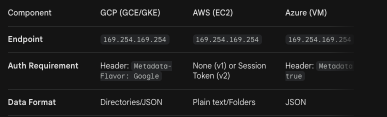


# cluster level WI before enabling at Node pool 
> [!quote]+ Workload Identity Federation for GKE **must** be enabled at the cluster level before you can enable Workload Identity Federation for GKE on node pools.
https://docs.cloud.google.com/kubernetes-engine/docs/how-to/workload-identity#enable_on_clusters_and_node_pools


# Design gotcha
For example, if a new cluster, Cluster C in the previous example was owned by an untrusted team, they could create a `backend` namespace and access Google Cloud APIs using the `back-ksa` ServiceAccount, just like Cluster A and Cluster B.

To avoid untrusted access, place your clusters in separate projects to ensure that they get different workload identity pools, or ensure that the namespace names are distinct from each other to avoid a common principal identifier.
https://docs.cloud.google.com/kubernetes-engine/docs/concepts/workload-identity#identity_sameness
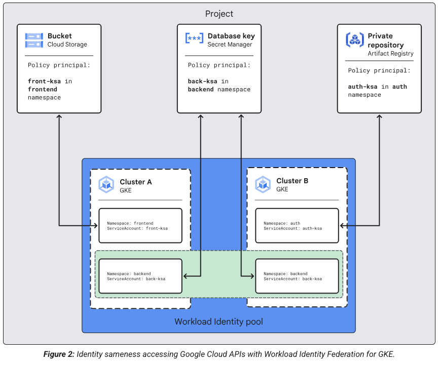
